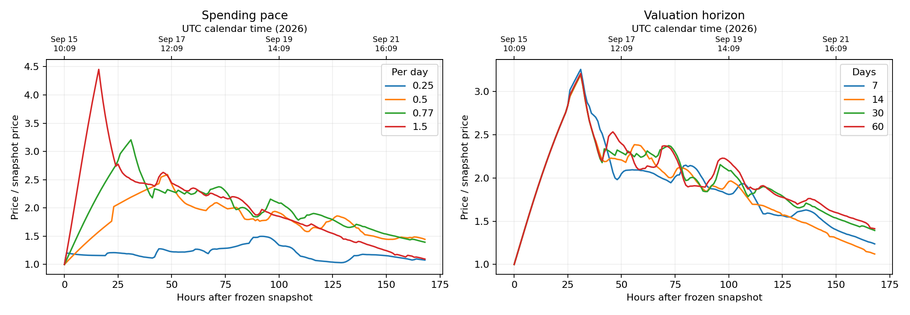

# Findings: demand decisions, taxes and the apparent top

[UTC timestamp reference](TIME_REFERENCE.md): elapsed hours/days are retained; calendar times are UTC.

**Decision-tree coverage:** [what participant choices are modeled, and what remains approximate](DECISION_TREE.md).

**The model does not establish a most likely top or a likely decline within 48 hours.** It now generates demand from profitable-looking actions and finite funds, but its baseline peak at +31 hours (2026-09-16 17:09:19 UTC) is strongly determined by an assumed spending pace. The forecast-consistency check also fails its stated tolerance. These are useful scenario experiments, not an equilibrium forecast.

[Executed agent notebook](rational_scenarios.ipynb) · [Spending-pace and valuation audit](assumption_sensitivity.ipynb) · [Equations, tax treatment and limitations](AGENT_MODEL.md)

All times below are measured from **September 15, 2026 at 10:09:19 UTC**, block 63,576,310. The observations are frozen. The simulation assumes existing locked protocol LP stays safe and in place.

## 1. What determines the apparent top?

The default assigns speculators 10,000 ETH and bankers 2,000 ETH, with different cash/token allocations to momentum followers and mean reverters. These balances are assumptions. Actors trade only when their forecasts clear the fee hurdle and they have the funds, subject to a participation allowance.

The default hourly allowance for an initially funded speculative cohort is its starting cash times `0.77 / 24`. A continuously buying cohort can spend its initial cash in about **31.17 hours**. That explains the suspiciously narrow +31-hour result across seeds: much of the apparent precision comes from the shared allowance, not evidence about actual future demand.

Changing just that pace produces:

| Assumed daily spending allowance | Peak of mean price, seven-day experiment |
| --- | ---: |
| 25% of initial cash | +92 hours (2026-09-19 06:09:19 UTC) |
| 50% | +48 hours (2026-09-17 10:09:19 UTC) |
| 77%: default | +31 hours (2026-09-16 17:09:19 UTC) |
| 150% | +16 hours (2026-09-16 02:09:19 UTC) |

Three common seeds per setting; the statistic is the peak of the mean path. At the slowest pace, the median of individual path peaks is +85 hours (2026-09-18 23:09:19 UTC) instead. These are different statistics, neither a fitted market probability.

**It is not necessary for all investors to run out of money.** At hour 31 (2026-09-16 17:09:19 UTC), aggregate speculative cash is still about 6,276 ETH. Much of that cash belongs to the participants who have been selling. The active optimistic buyers have used their budgets; the holders of the remaining cash need a sufficient expected return before spending it. At hour 32 (2026-09-16 18:09:19 UTC), mean speculative spending drops from roughly 273 to 46 ETH per hour, while gross pool outflows remain around 202 ETH. That imbalance causes the reversal in this experiment.

Valuation horizons of 7, 14, 30 and 60 days leave this early peak near +31 hours (2026-09-16 17:09:19 UTC), but substantially change later withdrawals and price paths. This supports the spending-pace explanation within this implementation; it does not validate the default pace.

## 2. Why might buying weaken—or continue?

There are several distinct mechanisms:

1. **Cash moves to actors with different beliefs.** Trading can transfer cash from willing buyers to sellers who want to retain ETH. Total cash alone is not a demand forecast.
2. **Expected appreciation stops covering fees.** The current-tax wallet round trip retains about 93.17% before price impact. Marginal purchases need enough expected appreciation to overcome that hurdle and the time/risk discount.
3. **License price exceeds expected incremental earnings.** Owners can wait for the Dutch auction to become attractive. The floor is a minimum ask, not a guaranteed executable price or guaranteed allocation.
4. **Reinvestment replaces outside purchases.** A license funded from the internal ledger does not buy STANDARD from the pool. Spending tokens already in a wallet likewise creates no fresh pool purchase at that moment.
5. **Capacity and dilution change the value of entry.** Per-Charter limits and daily quotas restrict purchases, while additional branches divide future issuance among more branches. Retirement can increase the remaining branches' shares.
6. **New capital or renewed optimism supports further buying.** Neither is ruled out. Both must be specified and measured rather than silently assumed absent.

The default completes about **1,400 license purchases over 14 days**, yet around **55% are funded internally**. Mean direct fresh license purchases total approximately **902 ETH**, and advance inventory purchases approximately **1,905 ETH**, versus **19,458 ETH of speculative purchases**. The last figure can exceed the initial speculative budget because sale proceeds are reused; the accounting does not call that reused cash a new contribution.

The “no initial banker cash/inventory” scenario still completes about **1,399 internally funded licenses**. Branch growth therefore does not by itself establish corresponding outside buying pressure.

## 3. Branch caps do not create a 48-hour saturation deadline

The observed system has 999 Charters and 1,099 branches. Ten branches per Charter implies 8,891 remaining slots for that fixed cohort. At 100 licenses per day, filling those slots takes at least **89 additional auction days**, assuming no retirement or new Charters. The three-license per-Charter daily limit is also enforced.

This is not a permanent global cap. Partial retirement reopens slots; final retirement destroys a Charter and removes its capacity; new Charters add capacity and an initial branch. The daily license quota still constrains expanded access. The hypothetical higher-quota sensitivity includes any newly available capacity during the remainder of the current auction day.

A rational buyer considers scarcity, expected dilution, fee-adjusted earnings and competing buyers. They do not rationally buy at any price just because the eventual capacity is finite. Under the illustrative snapshot valuation, flat-belief actors find some purchases attractive at four times the next illustrative floor but none at eight times; adaptive actors have different willingness. This worksheet resets eligibility to represent a possible future opportunity, since the observed auction day was already sold out.

## 4. Taxes materially change the game

The [official whitepaper](https://www.standardreserve.xyz/whitepaper/) distinguishes trading tax, the LP fee and the withdrawal resolution fee. The implementation uses the saved tax getters and tests resolution fees against pinned withdrawal previews.

| Transaction | Approximate fraction of gross spot value retained |
| --- | ---: |
| Sell tokens already in a wallet: 1% LP fee, 3% sell tax | 96.03% |
| Buy then sell: 2% buy tax, 1% LP fee on each swap, 3% sell tax | 93.17% |
| Withdraw ledger earnings at 2% resolution fee, then sell | 94.11% |
| Withdraw ledger earnings at 60% resolution fee, then sell | 38.41% |

These exclude price impact and are not returns on purchasing a branch. License principal is consumed; incremental earnings must recover it.

The seven-day resolution fee includes the proposed gross withdrawal. Every executed withdrawal changes the fee faced by subsequent actors. Half the fee is removed permanently from ledger claims; half is buffered for future recycling to remaining branches. Full and partial retirement are evaluated separately.

Consequently, “sell first” is not universally optimal. With the same gross earnings and unchanged trading taxes, waiting for a resolution fee to fall from 60% to 2% increases the retained token quantity by `0.98 / 0.40 = 2.45×`. Before discounting and market impact, that could offset a price decline of roughly 59%. But the fee may not decline when expected, the price may fall further, and the later sale itself contributes to congestion. The model therefore compares executable cash, not nominal token counts.

The launch's 90% hook taxes decay to the normal floors after an hour; the snapshot is already beyond that phase. A separate scenario applies hypothetical 10% buy/sell taxes. Dormancy fees do not arise because the modeled rational bankers perform the free check-in. LP fees remain in separately accounted uncollected claims; their eventual collection is not invented as extra demand.

## 5. What changes if ETH Charter sales open?

ETH Charter auctions are disabled in the saved state. The counterfactual opens them at +48 hours (2026-09-17 10:09:19 UTC), allows ten per day and uses an assumed 0.45 ETH first opening / 0.15 ETH floor. Buyers still need a positive modeled value and cash. This produces a mean **122.5 new Charters and 115.8 ETH of Charter receipts** over the experiment.

That ETH enters the fee engine: 70% to the active vault, 15% to POL and 15% to the team at modeled epoch settlement. It is **not an immediate token purchase**. New owners can subsequently purchase licenses, but the same global quota applies. New initial branches also dilute issuance per branch.

Delaying sales can preserve incumbents' issuance shares and defer competition for the license quota. Opening sales can collect outside ETH and broaden future participation. Which helps incumbent returns or token price more depends on those competing effects. In this run, opening after +48 hours (2026-09-17 10:09:19 UTC) does not move the earlier peak; its later price and branch outcomes differ. This does not prove the team's chosen timing is optimal.

The separate buyback/POL scenario includes taxes, routing and capped spending, conditional on authorization and TWAP gates permitting execution. It spends about **372 ETH on buybacks and 84 ETH on POL token purchases**. Support changes actors' behavior, so it does not guarantee that every later price is above the no-execution path. Retained reserves are not treated as token-holder redemption rights.

## 6. Exit timing depends on what you own

The new main experiment uses 12 seeds per scenario. “Best wallet sale” maximizes average executable proceeds for a protected 100,000-token wallet at one precommitted time. The protected representative one-branch Charter continues earning before each hypothetical withdrawal. Population agents can retire partially; the representative timing comparison is a full exit.

| Scenario | Median path price peak | Best wallet sale | Best existing one-branch exit |
| --- | ---: | ---: | ---: |
| Adaptive, Charters closed | +31 h / 1.29 days 2026-09-16 17:09:19 UTC | +31 h / 1.29 days 2026-09-16 17:09:19 UTC | +327 h / 13.62 days 2026-09-29 01:09:19 UTC |
| ETH Charters open at +48 h (2026-09-17 10:09:19 UTC) | +31 h / 1.29 days 2026-09-16 17:09:19 UTC | +31 h / 1.29 days 2026-09-16 17:09:19 UTC | +327 h / 13.62 days 2026-09-29 01:09:19 UTC |
| Buybacks and POL executed | +31 h / 1.29 days 2026-09-16 17:09:19 UTC | +31 h / 1.29 days 2026-09-16 17:09:19 UTC | +130 h / 5.42 days 2026-09-20 20:09:19 UTC |
| Additional 3,000 ETH/day | +233 h / 9.71 days 2026-09-25 03:09:19 UTC | +237 h / 9.88 days 2026-09-25 07:09:19 UTC | +327 h / 13.62 days 2026-09-29 01:09:19 UTC |
| Flat price beliefs | Snapshot: 2026-09-15 10:09:19 UTC | Snapshot: 2026-09-15 10:09:19 UTC | +336 h / 14.00 days 2026-09-29 10:09:19 UTC: unresolved boundary |
| External license funding only | +31 h / 1.29 days 2026-09-16 17:09:19 UTC | +31 h / 1.29 days 2026-09-16 17:09:19 UTC | +207 h / 8.62 days 2026-09-24 01:09:19 UTC |
| 10% buy and sell taxes | +31 h / 1.29 days 2026-09-16 17:09:19 UTC | +31 h / 1.29 days 2026-09-16 17:09:19 UTC | +31 h / 1.29 days 2026-09-16 17:09:19 UTC |
| No initial banker cash/inventory | +31 h / 1.29 days 2026-09-16 17:09:19 UTC | +31 h / 1.29 days 2026-09-16 17:09:19 UTC | +114 h / 4.75 days 2026-09-20 04:09:19 UTC |

**These are model optima, not recommended orders.** The additional-capital scenario assumes **42,000 new ETH over 14 days**; it is not an observed forecast of inflows. Two of its twelve price paths peak at the final horizon. The main baseline peak is +31 hours (2026-09-16 17:09:19 UTC), but the spending-pace audit demonstrates why that timestamp is not identified by the evidence.

The fee recycling, changes in earning share, seven-day withdrawal expiry and later price path can make a branch's best modeled exit much later than a wallet's. Conversely, high trading taxes or different funding assumptions change those incentives. There is no universal sale time across position types.

| Position | Potential benefit | Main economic risk or constraint |
| --- | --- | --- |
| Existing wallet tokens | Immediate executable sale; flexible timing | Price and market impact; no branch earnings |
| Existing Charter/branches | Continued issuance, larger share after retirements, recycled fees | Dilution, congestion, token price, sacrificing earning capacity on retirement |
| New externally funded license | Incremental future issuance | Upfront consumed tokens, uncertain future value, auction cost and eligibility |
| Ledger-funded license | Larger future earning share without a fresh cash payment | Gives up withdrawable claims; reinvestment is not free |
| Funding another owner's branch | Contractually shared incremental earnings | No tested native independent non-owner withdrawal right; owner control, timing and enforceability |

The third-party worksheet is explicitly hypothetical. It varies payout shares and payment assumptions, charges the full market funding cost and shows the break-even share. Its large adaptive-belief valuations are forecasts under optimistic assumptions, not measured realizable returns. No agreement or independent exit mechanism is implemented by this repository. See the older notebook for additional wallet sizes and ten-branch comparisons.

## 7. Do these actors correctly anticipate each other?

**Not established.** In the baseline, the median realized price seven days later is about **40% of the model's corresponding price expectation**. A decision can maximize a mistaken forecast and still lose money. “Profit-seeking under beliefs” must not be presented as perfect foresight or a solved rational-expectations equilibrium.

The five-pass damped forecast-consistency experiment ends with a maximum absolute log-price residual of **0.0658**, above the stated 0.05 tolerance. Its residual is not steadily falling, and its trial peaks vary substantially. The experiment also uses a flat terminal tail and a restricted action set. It does not establish convergence or equilibrium.

This is the main answer to “why, assuming rational actors?”: the rules and budget constraints can be modeled, but future demand requires beliefs about everyone else's choices. An internally consistent solution is harder than assuming that every buyer expects a profitable exit. The present diagnostics show that this assumption remains unresolved.

## 8. What would improve a real forecast?

The highest-value missing inputs are observations of **willing buyers' remaining capital and participation rate**, the actual split between ledger/inventory/fresh license funding, and how license willingness changes with price and dilution. Repeated snapshots of withdrawals and seven-day congestion would improve exit-fee forecasts. Actual auction policy and executable protocol purchases matter more than treating announced reserves as automatic market demand.

A useful continuation is to fit those quantities on a rolling observation window and test subsequent unseen periods. This repository contains no predictive backtest that validates the assumed budgets, spending pace or expectations.

All 31 numerical tests pass. Published main-path accounting residuals are below approximately **6.1e-10 ETH**, **2.4e-6 physical tokens** and **1.3e-7 ledger tokens**; these are floating-point residuals. Integrity checks cover all three executed notebooks, source/evidence hashes, saved tables, liquidity reconciliation and cap enforcement. Accounting correctness does not establish forecasting accuracy.
