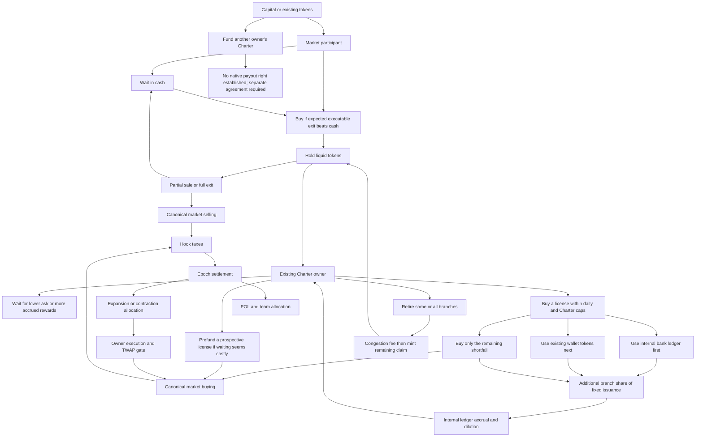
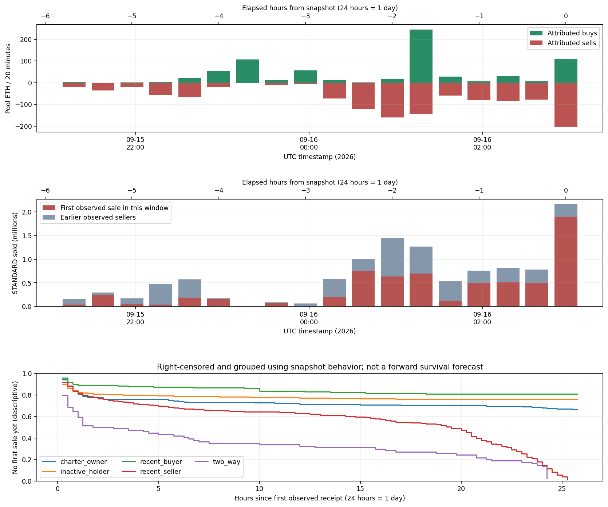
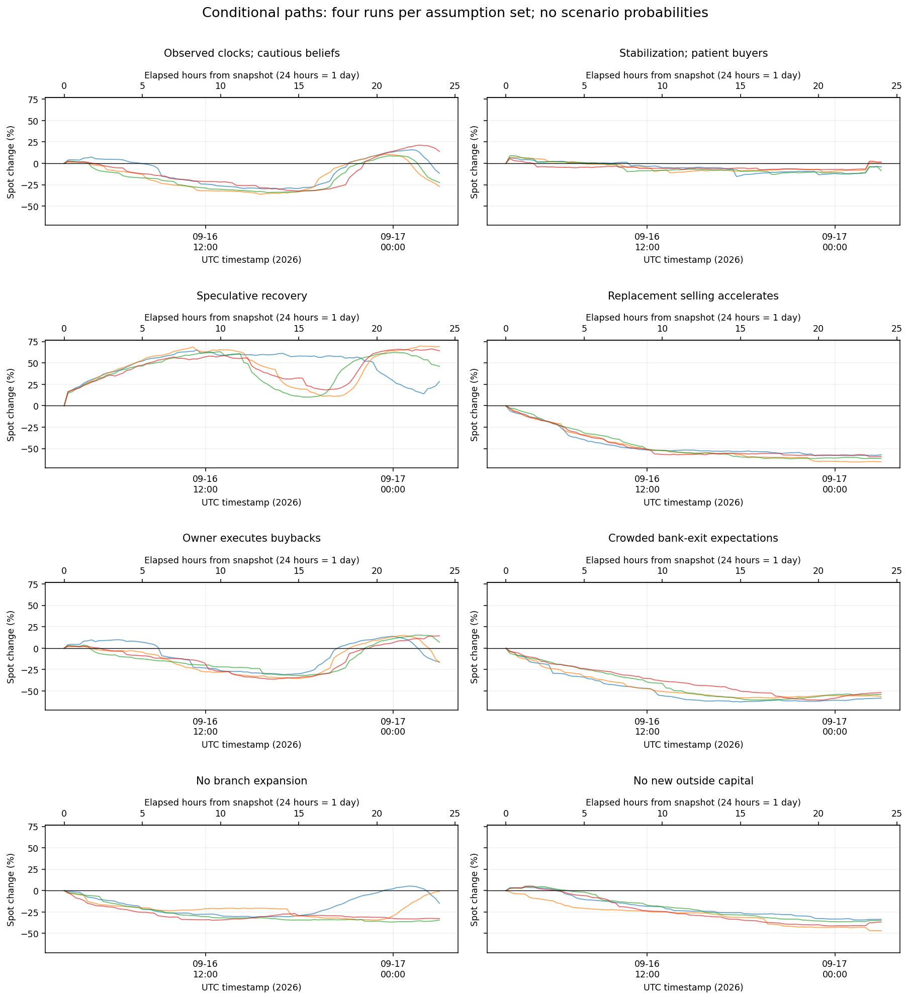
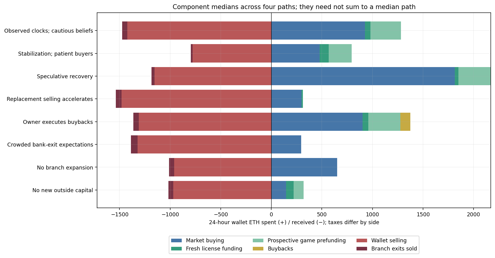

# Participant behavior and flow map

**Snapshot: September 16, 2026, 02:57:33 UTC · Robinhood chain 4663 · block 64,168,224.**

Token: `0x88ad8DdF1E3898412146a534538d418c6F8A9062`. This is a dated snapshot, not a live quote.

**[Open the executed notebook](participant_behavior.ipynb)** · [Model rules](BEHAVIOR_METHOD.md) · [Raw scenario results](behavior-results/scenario-runs.csv) · [Decision model](behavior_model.py).

## Main findings

1. **Remaining sellers are not a closed group.** The latest 20-minute attributed window contains 87.7% of sold tokens from addresses making their first observed canonical sale in that window. Existing sellers can empty while other holders take their place. There is no defensible depletion countdown without modeling that replacement.
2. **Branch sales create much less immediate market demand than their token cost suggests.** Between 00:44:57 and 02:57:33 UTC, 54 licenses cost 1,269,759 STANDARD. Only 99,417 tokens (7.8%) are allocated to new canonical purchases under pro-rata funding attribution. Prior bank balances, newly accrued rewards and prefunded wallet inventory supplied most of the rest. Net canonical flow was -291.1 ETH and spot fell 14.2%. No branch withdrawals occurred in this follow-up interval.
3. **All 46 remaining licenses can feasibly be funded without another market purchase.** A shared-wallet allocation proves this possibility; it does not predict who wins. Buying every license entirely fresh at the current ask would cost about 80.5 ETH. Neither number is compulsory demand. Waiting changes the ask; the quota resets at **September 17, 01:04:04 UTC**.
4. **Buybacks help, but are neither scheduled nor sufficient by themselves for a profitable canonical re-entry in the tested case.** The vault holds 111.72 ETH and has never ticked at this pin. The current first-tick limit is 6.21 ETH. A 1 ETH entry followed by 24 successful hourly buybacks and no sellers produces roughly +5.45% spot movement but a **−1.81% net round trip**, before gas. Pool fees and hook taxes impose approximately a **7.33% small-trade price hurdle**; larger trades need more.
5. **Rational behavior alone does not select a most likely price path.** Participants can rationally hold different beliefs. The same observed inventories produce declines, stabilization or recovery under different explicit beliefs and new-capital assumptions. A simple prior-hour flow extrapolation also fails badly in the saved holdout windows. This model is useful for testing conditions, not assigning an unsupported probability that the top is in.

## What people can do



Each Charter has its own bank ledger. Charters belonging to the same wallet share that wallet's tokens and cash. Depositing burns wallet tokens into an internal claim; retirement releases a net minted claim and destroys the retired branches. Internal issuance is **not** an automatic sell and is **not** ETH revenue. An owner can retire and keep the minted tokens instead of immediately selling.

ETH Charter auctions are disabled at the snapshot. The new simulation therefore permits expansion only through the existing owners. It does not invent a right for outsiders to open or withdraw another owner's branches. Funding another person is an additional agreement and counterparty exposure, not a native branch return.

## Observed inventory, cadence and provenance

There are **62.715 million wallet tokens** outside identified protocol custody, plus **1.413 million pending bank claims**. Do not add pool inventory to the wallet sell overhang. The 547 six-hour sellers retain **2.421 million tokens**; 445 are already empty at the pin. Future selling can come from other holders and minted withdrawals too.

The pool curve contains **2,223.33 ETH** of principal and **33.383 million STANDARD**. Locked liquidity is assumed to remain available throughout. That protects against removal in this experiment; it does not prevent sales from drawing ETH out of the pool.



[Per-wallet population](behavior-results/population.csv.gz), [classified trades with transaction IDs](behavior-results/classified-trades.csv.gz), [acquisition records](behavior-results/participants/acquisitions.csv.gz), [sale provenance](behavior-results/participants/sell-provenance.csv), [cadence](behavior-results/cadence.csv) and [funding attribution](behavior-results/funding/followup-license-funding.csv) are included. These are address-level observations, not identified people. Trade timestamps between archived headers are interpolated; minute-level gaps and window membership are approximate.

Recent sellers' median measured sale fraction is about 95%; Charter owners' is about 60%. These are transaction fractions, not promises to liquidate that share again. Repeat-trade gaps are conditional on repeating and often reflect launch bursts. The simulation uses recent per-wallet event counts and partial-sale fractions rather than extrapolating sub-minute launch gaps all day. Snapshot-conditioned strategy labels and first-sale survival curves are descriptive, not causal predictors.

## Conditional 24-hour paths

All paths start **September 16, 02:57:33 UTC** and end **September 17, 02:57:33 UTC** (+24 hours / +1 day). Four seeded runs per case expose some model dispersion; they are too few and too assumption-dependent to estimate market probabilities. The range below is only the minimum and maximum of those four runs.

| Assumption set | 24h median | Four-run range | Fresh license ETH | Prefunding ETH | Branches retired |
| --- | --- | --- | --- | --- | --- |
| Observed clocks; cautious beliefs | -16.9% | -27.1% to +14.0% | 53.7 | 300.4 | 41 |
| Stabilization; patient buyers | -1.5% | -8.6% to +1.6% | 88.2 | 227.2 | 9.5 |
| Speculative recovery | +55.2% | +28.3% to +69.3% | 35.5 | 322.1 | 12.5 |
| Replacement selling accelerates | -60.4% | -65.3% to -57.3% | 11.3 | 4.3 | 53 |
| Owner executes buybacks | -4.4% | -16.7% to +14.5% | 55.9 | 316.6 | 41 |
| Crowded bank-exit expectations | -55.3% | -58.5% to -51.9% | 1.1 | 0.4 | 418 |
| No branch expansion | -23.7% | -34.5% to -0.8% | 0.0 | 0.0 | 37.5 |
| No new outside capital | -35.8% | -46.8% to -33.6% | 74.9 | 97.3 | 37.5 |

“Observed clocks” means activity timings are initialized from history. Its future price beliefs, participant attention, prospective purchases and capital arrivals are still assumptions. Future new-buyer budgets are resampled from the last two hours' first-buyer spending, approximately 28.1 ETH/hour before any multiplier. This is **not proof that this much outside ETH will arrive**. Existing 6,839 ETH of measured native balances are a capacity ceiling, not committed demand.





The cautious case produces a median -16.9% one-day spot move, but its four paths span a gain and a loss. It must not be relabeled a “most likely” forecast. A recovery case requires considerably more speculative buying, supported here by stronger beliefs and twice the assumed newcomer arrival rate. Under faster seller activation and weaker incoming demand, the four runs end around −57% to −65%.

The separate [sensitivity runs](behavior-results/assumption-sensitivity.csv) alter action ordering, the time step, prospective branch prefunding and the branch valuation horizon. Changing the step from 15 to 7.5 minutes changes the two tested returns to roughly −21% and +6%. Random-clock discretization and feedback matter; these are **not numerically stable trade-timing estimates**.

## What would support a recovery?

The robust question is how much buying is needed for a specified seller inventory and price target. [The flow requirement table](behavior-results/recovery-flow-requirements.csv) uses the actual liquidity ranges, taxes and pool fee. With no sales, roughly **184 ETH** of gross market buying produces +10% spot, **427 ETH** produces +25%, and **775 ETH** produces +50%. Selling adds to those requirements; a spot recovery does not equal the same return to a new buyer after fees.

Watch these quantities together: new versus repeat seller volume; remaining inventories and fresh receipts; actual deposits funded by new market purchases; spending by genuinely new buyer addresses; and successfully executed buybacks. A shrinking old-seller inventory on its own is insufficient. Owner market buys must not all be labeled game purchases.

## Selling times and the “optimal” path

The notebook compares **precommitted 0, 1, 3, 6, 12 and 24-hour exits**, with both elapsed days and UTC timestamps. It reports executable proceeds for a 10,000-token marginal order and net returns for an illustrative 1 ETH re-entry. These quotes are on saved crowd paths and do not rerun the crowd around your order. Larger positions require a full counterfactual replay with their inventory removed from the population.

The model also saves every simulated license purchase and branch retirement with its elapsed time. Hindsight peak times are available in `scenario-runs.csv`, but are not a policy you could have known in advance. An end-of-window peak is unresolved beyond the horizon. The branch continuation grid spans one hour to 60 days by default; a best value at 60 days is not a predicted 60-day selling date.

**Practical interpretation:** this evidence supports separating optional game demand from committed market flows and testing seller replacement against real buying budgets. It does not establish that an exact recovery, top or best entry/exit time has been predicted.

## Reproduce and inspect

Install `requirements.txt`, then run offline from the repository root:

```bash
python behavior_refresh.py
python behavior_funding.py
python behavior_observations.py
OPENBLAS_NUM_THREADS=1 python behavior_model.py
OPENBLAS_NUM_THREADS=1 python behavior_sensitivity.py
python behavior_analysis.py
python build_behavior_notebook.py
python run_notebook.py participant_behavior.ipynb
python -m unittest discover -p test_behavior.py -v
python verify_behavior.py
```

The published manifest freezes evidence, source and outputs. Rebuilding compressed files, figures or notebook outputs can change byte hashes even when the analysis agrees; verify the published copy before rebuilding, and deliberately create a new manifest after a reviewed refresh. Collectors are read-only public-RPC scripts, but their output location is fixed: copy them into a new evidence workspace before collecting another snapshot. No keys, signatures, trading transactions or credentialed endpoints are needed.
