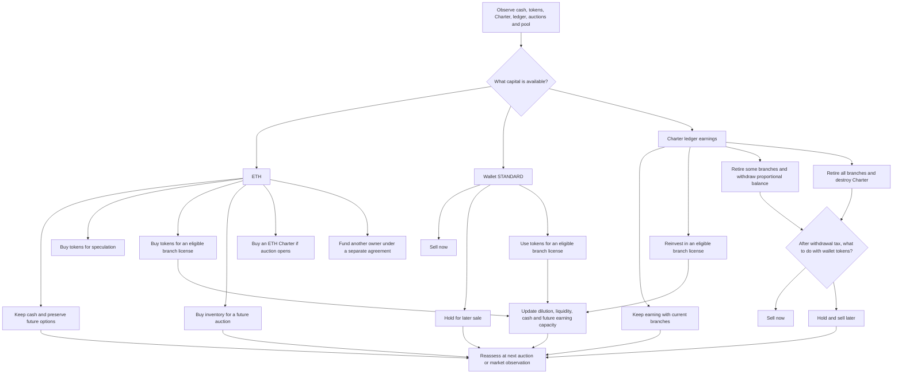

# Does the model capture participants' capital-allocation decisions?

**It captures STANDARD's main transaction mechanics and several immediate choices. It does not yet capture the full strategic decision tree well enough to label its allocation or selling time optimal.** The agent model is a constrained scenario simulator with approximate continuation values.

Here “utility” has two meanings: STANDARD's token/Charter uses, and the participant's objective. The model represents several protocol uses. Its objective is discounted expected ETH under a forecast; it does not estimate an individual's risk preferences or liquidity needs.

## The participant's decision tree

This is the conceptual choice tree, **not a claim that every route is implemented**. Existing ownership and authorization constrain each route. A non-owner cannot independently withdraw another owner's native branch in the tested interface; the third-party route is a hypothetical agreement only.

## Coverage of that tree

| Decision or interaction | Current implementation | Important missing part |
| --- | --- | --- |
| Buy versus retain ETH | Speculative reservation price, cash constraint and participation allowance | Full comparison with future branch/Charter purchases and the option value of unspent cash |
| Sell versus retain wallet tokens | Forecast price versus current price; tax and market impact | Full multi-period portfolio optimization; risk/uncertainty and liquidity needs |
| Use cash, inventory or ledger for a license | Compares incremental continuation value and funding costs; enforces eligibility | Multiple future purchases as a coordinated plan; optimized funding mixture and transfer/deposit strategies |
| Buy a license now versus skip | Requires a positive modeled surplus at the current ask | Explicitly value waiting for a lower Dutch-auction price against the risk of losing allocation |
| Prefund a future license | Forecast cost saving with bounded expected allocation | Strategic auction competition, stochastic allocation and resale fallback valued together |
| Keep versus partly/fully retire | Compares immediate cash plus retained-branch continuation value | Complete future sequences of retirement/reinvestment; detailed common-owner portfolio effects |
| Withdraw now versus sell now | Retirement immediately sells the net withdrawal in the population model | Decouple withdrawal timing from token-sale timing: securing today's resolution fee can be a separate decision |
| New ETH Charter | Buy when the forecast initial branch value exceeds the ETH ask | Expansion-option value and optimal auction waiting; calibrated demand for new Charters |
| Fund another owner's branch | Conditional value-sharing worksheet | Binding agreement, ownership/control, payment timing and negotiated terms; not an agent action |
| Anticipate other participants | Moving branch/withdrawal forecasts; adaptive price beliefs | Self-consistent auction strategies and an equilibrium of mutually anticipated decisions |
| Value an ongoing Charter | Best forecast withdrawal over candidate horizons up to a configured cutoff | A consistent terminal continuation value or sufficiently long converged solution |
| Protocol action feedback | Taxes, epoch policy and optional buyback/POL flows | Optimized/governance-dependent timing and future range placement; operational execution remains conditional |

## What the current value function actually does

`V(n, B)` asks: with n branches and current ledger B, which of a finite set of future **full-withdrawal horizons** gives the highest forecast discounted sale proceeds? It then uses this estimate to compare some immediate actions, including a partial retirement plus the remainder's value.

It does **not** recursively optimize all future actions. For example, it does not solve:

> Wait three hours for a lower license ask; buy only if quota remains; reinvest after four days if dilution stays low; otherwise withdraw one branch before congestion; hold the minted tokens and sell later if the expected market improves.

That distinction matters even if everyone seeks profit. A positive expected payoff from buying now does not prove buying now beats waiting or another use of the same cash. A fixed spending allowance is a constraint imposed by the researcher, not a derived preference of a rational participant.

The flat-belief scenario is also not a forecast that price will stay flat. It means actors *believe* that when making decisions; their trading can produce a declining path. The forecast-error table measures this mismatch.

## A more complete allocation model

A finite-horizon stochastic control formulation would use a state such as:

`state = cash, wallet tokens, branches, ledger, auction ask/quota/day, pending system claims, seven-day withdrawal buckets, pool ranges, protocol reserves/policy, beliefs about competitors`.

At each observation it would choose an allowed action using:

`V_t(state) = max_action E[ immediate discounted cash flow + V_(t+1)(next_state) | information available now ]`.

The terminal value must include executable net wallet proceeds and a defensible continuation value for surviving branches; otherwise the chosen cutoff can manufacture a retirement deadline. A risk-sensitive objective could penalize downside or satisfy minimum cash needs. Scenario weights would need explicit justification.

A tractable next implementation would optimize **one representative participant against stochastic population paths**, with limited branch/cash states, then iterate the population's responses. That could improve capital allocation without pretending to solve the full game. It should include:

1. Auction waiting and allocation uncertainty.
2. Separate withdrawal and token-sale decisions.
3. Competing uses of ETH and ledger earnings, with future purchases included.
4. Partial retirement and remaining-Charter terminal value.
5. Forecast uncertainty and out-of-sample policy evaluation.

A policy optimized against a known realized future path is a **hindsight benchmark**, not an executable forecast-based strategy. Any extension must keep that distinction explicit.

## What the present model can support

It is useful for asking **which assumptions or mechanisms drive a result**: caps, funding sources, fees, dilution, capital availability or protocol spending. It is not yet sufficient to claim that a rational participant should follow a particular complete capital-allocation policy or sell at a uniquely optimal hour.

The [assumption audit](assumption_sensitivity.ipynb) and [forecast-consistency results](AGENT_FINDINGS.md#7-do-these-actors-correctly-anticipate-each-other) demonstrate that limitation numerically. They are central findings, not reasons to hide the model's output.
