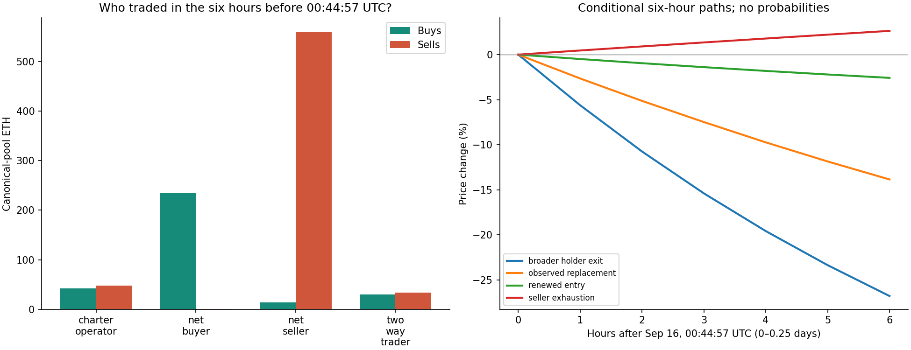

# STANDARD: who is trading, where tokens came from, and what branch buyers actually did

**Participant snapshot:** 2026-09-16T00:44:57+00:00 · block 64,089,150.

**Latest auction observation:** 2026-09-16T01:14:41+00:00 · block 64,106,912.

Robinhood chain 4663 · STANDARD `0x88ad8DdF1E3898412146a534538d418c6F8A9062`.

[Executed notebook](participant_analysis.ipynb) · [All participant tables](participant-results/) · [Pinned RPC evidence](strategy-current/) · [Reproduction and limitations](PARTICIPANT_METHOD.md)

## Findings

**This was primarily a market-inventory selloff, followed by an auction-period rebound that quickly weakened. It was not an observed bank run.** There was one branch withdrawal in the entire pre-snapshot history and **0 new withdrawals** in the follow-up. A Charter owner selling wallet tokens is not necessarily retiring a branch.

- In the six hours before the snapshot, the canonical pool processed **321.8 ETH of buys and 644.4 ETH of sells**. We attribute **99.41% of buying and 99.75% of selling** to token source/recipient addresses.
- **88.7% of attributed sold tokens** trace to purchases on the canonical or two verified secondary pools, directly or through transfers. The rest remain other-custody/unresolved acquisition sources. Pro-rata lineage is an accounting convention; fungible tokens have no unique identity.
- **257 of 335 recent selling addresses were empty** at the snapshot. The group had **2.771 million tokens left**. Constantly extrapolating its earlier sale rate ignores inventory exhaustion.
- The inactive/unattributed cohort held **50.27 million tokens**. That is potential inventory, not an assumption that all those owners will sell. New sellers, rather than endlessly repeating exhausted sellers, are the main continuation risk.
- **51 licenses actually sold** after the reset, costing **1.209 million tokens**, and total branches reached **1,150**. Expansion demand exists. Bank deposits were **1.148 million tokens**; **87.0%** came from inventory already in wallets at the snapshot.
- Estimated actual license-payment sources were **90.2% prior bank balance or prefunded wallet inventory**, plus new issuance and post-snapshot acquisitions. Only **99,404 tokens** of license payments trace to new canonical-pool acquisitions after the snapshot.
- During the follow-up, license-buying addresses made **23.4 ETH of canonical buys** out of **229.9 ETH total**. They also sold **3.0 ETH**. All Charter owners together bought **77.8 ETH**. Wallet category establishes ownership/activity, not motive.

## The auction did not guarantee a sustained rally

At **01:09:32 UTC**, 50 licenses had sold, net canonical flow since 00:44:57 was **+111.5 ETH**, and price was **+6.4%**. By **01:14:41 UTC**, only one more license had sold; renewed selling reduced cumulative net flow to **+22.6 ETH** and the price gain to **1.2%**. These are observed checkpoints, not a successful model prediction or proof that licenses caused every purchase.

There were **49 licenses left**. At the latest auction price, repeating the observed post-snapshot acquisition share would correspond to roughly **12.8 ETH** of additional token buying for those licenses at the observed token price, before further price movement and route-specific costs. That is a conditional benchmark: different owners may use all old inventory or need much more new capital. A token burn is not the same quantity as an ETH market buy.

**Evidence-based assessment:** a tradable bounce has already occurred, but this evidence does not establish a renewed upward trend or a most-likely all-time top. Continued weakness requires additional holders choosing to exit; sustained recovery requires buyers absorbing that replacement selling after the auction burst. The immediately observed pattern is a fragile rebound, not automatic extinction of buy demand.

## Who sold?

Canonical-pool portions only, six hours ending 00:44:57 UTC. Addresses may be contracts or smart accounts; they are not identified people.

| address | 6h sell ETH | Tokens left | Charters |
|---|---|---|---|
| 0x14b33822c8bc5689e4130b0d3fca676674fb6718 | 79.463 | 312,861.722 | 0 |
| 0x2444429b617062858c0b789608bf0e9fae313db3 | 45.471 | 0.000 | 0 |
| 0xa1e1a2d159166a85a5e1f7142146013b93968c5b | 43.071 | 0.000 | 0 |
| 0x24e7a8963c07dc0ad58098172ab2b9826bc90fb2 | 33.187 | 200,000.000 | 0 |
| 0xbebbad0b95ed88e6c56c8d79daa82257e97c3f44 | 33.083 | 0.000 | 0 |
| 0x5b0051e4ea8eaf6ec523ab2aa76fe0149e68b040 | 28.427 | 0.000 | 0 |
| 0x9c8ff2cb10eb8306c98765ae3f9b2e8a4c6233ee | 25.124 | 0.000 | 1 |
| 0xfb0d8b94027c5109ae89c5f08b025cc598cf6f49 | 25.009 | 0.000 | 0 |

The largest seller, `0x14b33822c8bc5689e4130b0d3fca676674fb6718`, previously acquired **988,797.54 tokens in attributed canonical purchases**. It sold **675,935.82** in four trades, each taking **25% of the then-remaining balance**, and retained **312,861.72**. Its attributed pool-side acquisition cost was **139.71 ETH**; the sold fraction had a weighted pool-side cost of **95.50 ETH**, versus **79.46 ETH gross pool proceeds**. Those figures exclude route costs, launch taxes and gas, so they are not a complete realized-P&L statement. They do not support calling this profit-taking at an exceptionally cheap basis.

[Transaction-level trades and sale provenance](participant-results/trades.csv.gz) retain full hashes, exact blocks, matched transaction senders where checked, route allocation and timestamp precision. A transaction's bundler/router sender is not substituted for the token-owning account.

## Who bought?

| address | 6h buy ETH | Tokens held | Native ETH held | Charters |
|---|---|---|---|---|
| 0xa2ee0d9d3da9b93aea50418b25a2c68d03d3fa94 | 48.216 | 376,751.504 | 0.070 | 0 |
| 0x8f5369de2ca0c17a722c43d1e02ee9ac7a16c763 | 35.726 | 437,363.976 | 0.358 | 0 |
| 0x6f97b7de6be7b7771e975e46bae96c35e332e172 | 24.647 | 251,715.072 | 4.555 | 2 |
| 0x27d25ebe6637e4b173ec7d0546cd54d1b74828e0 | 16.815 | 138,373.533 | 0.059 | 0 |
| 0x00fbfab3a2941a0a6450a731c5f90e3ac8d48265 | 9.800 | 0.000 | 15.104 | 0 |
| 0xc90d95d2ae793ad128ef3c3e4892a195afe6af7b | 9.800 | 78,486.923 | 20.001 | 0 |

Native ETH is only one funding asset. Wrapped ETH, stablecoins, new transfers, borrowing and cross-chain capital are not comprehensively measured. Missing ETH readings for older fully exited addresses remain missing. Zero native ETH does not prove inability to buy. Common funding and token transfers do not establish common beneficial ownership.

## Charter and branch decisions

At the participant snapshot, **999 Charters belonged to 941 addresses**, with **1099 branches**, **1.409 million tokens pending internally**, and **9.456 million tokens in owner wallets**. Shared owner inventory is counted once across all its Charters.

A feasible allocation could fund all next-day 100 licenses using existing balances and wallet tokens with **zero compulsory new pool buying**. This is a feasibility result, not an optimal allocation or an expectation that those exact owners buy. Actual owner choices above show some new buying and substantial use of old inventory.

For the median existing Charter, another day of issuance can offset roughly **49.2%** of price decline in the one-day comparison, assuming quiet withdrawal fees and 100 added branches/day. A heavily prefunded Charter has much less percentage growth in its bank balance, so its exit incentive is different. Future mass withdrawals can raise resolution fees and reverse that comparison. The full owner-by-owner thresholds are in [branch-hold-thresholds.csv](participant-results/branch-hold-thresholds.csv).

At the next opening price, one additional branch cost about **37.3 days of its initial gross issuance share**, before dilution, withdrawal fees and price changes. Our 14-day full-retirement calculation is deliberately a **horizon sensitivity**, not a complete explanation of observed license buying: it omits the ongoing branch's terminal option value and partial-retirement paths. The actual 51 purchases show why those omissions/longer horizons matter. It is not valid to declare all buyers irrational or set future license demand to zero from that truncated calculation.

Ownership-history replay matches every live Charter. **All 158 pre-snapshot deposits came from the then-owner**, including the Charter later burned. No third-party funding strategy was observed in those deposits. Sending tokens to someone else's Charter creates no automatic payout right for the sender; a private agreement is outside the on-chain payoff model.

## Conditional flow paths

These six-hour **pre-auction snapshot stress paths** use actual remaining inventories, measured new-buyer activity, replacement-seller activity and native-ETH spending ceilings. They are not probabilities or a solved equilibrium. They exclude new bank withdrawals, license-specific incremental purchases and automatic vault execution. They must not be represented as a forecast incorporating the later auction outcome.

| Conditional scenario | 6h change % | Buyer ETH spent | Tokens sold |
|---|---|---|---|
| seller_exhaustion | 2.633 | 253.415 | 1,823,438.007 |
| observed_replacement | -13.844 | 253.415 | 4,888,158.932 |
| renewed_entry | -2.579 | 486.544 | 4,888,158.932 |
| broader_holder_exit | -26.774 | 253.415 | 7,952,879.858 |

The central sensitivity replaces retiring sellers at the observed first-sale volume. “Renewed entry” sustains the stronger last-two-hour arrival rate. “Seller exhaustion” assumes no replacement sellers. Buyer spending stops above an explicitly assumed reservation value. The observed later auction/rebound is shown separately; we do not backfill it into the earlier calibration or claim the paths predicted it.

## Liquidity, taxes and audit limits

The frozen curve contains **2,369.07 ETH of actual principal** and every initialized tick. Locked protocol liquidity is kept safe in the model, as requested. Swaps can still extract ETH. Quoted trades include the **1% LP fee, 2% buy tax and 3% sell tax**; branch exits separately pay the resolution fee. Optional router fees and gas are not assumed to disappear from actual execution but are not included in these protocol-only scenario quotes.

Observed auction sales exactly match **halving the gap to the floor every four hours**. The whitepaper's displayed geometric-to-floor equation disagrees with its prose and those sales; this model uses the measured behavior. [Official whitepaper](https://www.standardreserve.xyz/whitepaper/).

We replayed **213,702 token transfers**, **49,945 canonical swaps**, 1,001 Charter ownership transfers and secondary-pool acquisition records. Token supply reconciles with integer arithmetic; every collected wallet token balance matches pinned state. The later bank ledger also reconciles. Remaining limits: route ambiguity, approximate times between exact headers, fungible-token attribution convention, unmeasured external capital, address/person ambiguity, future policy and liquidity changes, and unobserved beliefs. These limit claims about a uniquely rational action or calibrated likelihood.
