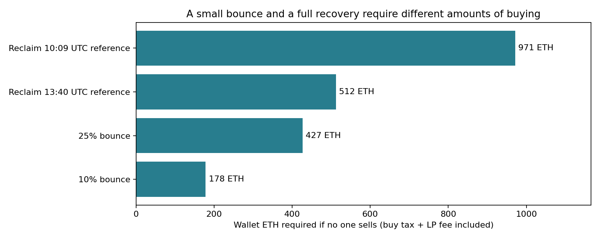
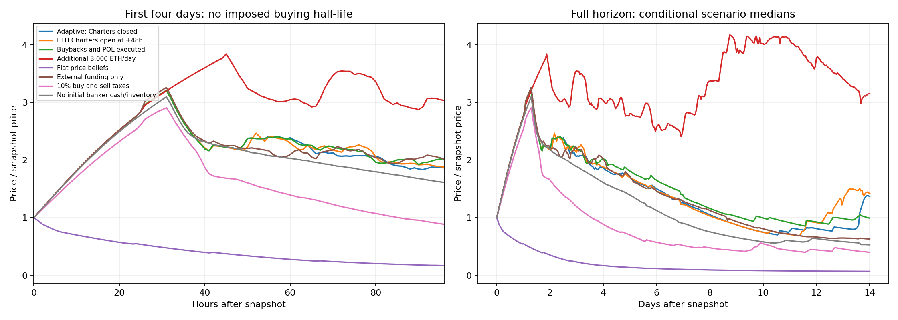

# STANDARD research: incentives, taxes, liquidity and exits

[UTC timestamp reference](TIME_REFERENCE.md): elapsed hours/days are retained; calendar times are UTC.

**Decision-tree coverage:** [what participant choices are modeled, and what remains approximate](DECISION_TREE.md).

An executed, editable notebook for wallet tokens, Charter earnings, branch purchases, reinvestment and hypothetical funding of someone else's branch.

**[Open the agent notebook](rational_scenarios.ipynb)** · **[Read the findings](AGENT_FINDINGS.md)** · [Model and tax details](AGENT_MODEL.md) · [Evidence and reproduction](DATA.md)

## Latest evidence-conditioned recovery update

**[Executed recovery notebook](recovery_update.ipynb)** · **[Updated assessment](RECOVERY_FINDINGS.md)**

The September 15, 2026 **22:45:58 UTC** update uses a fresh price, all 77 initialized liquidity ticks, current fees, auction quotas and observed selling. It distinguishes a bounce from regaining earlier prices and calculates the ETH buying required. Scenarios vary seller exhaustion, continuing demand, license funding, buybacks and branch withdrawals. They do not assign calibrated probabilities or claim to know the all-time top.



Run `python run_notebook.py recovery_update.ipynb`. This is a new short-horizon supplement; the agent experiments below retain their original 10:09 UTC snapshot and are not current forecasts.

Earlier observations: [13:40 UTC](live-observations/2026-09-15T13-40-35.886Z/FINDINGS.md) and [22:34 UTC](live-observations/2026-09-15T22-34-29.773Z/FINDINGS.md).

## What can this tell us about the top?

**The available evidence does not establish a most likely top or a decline within 48 hours.** The new model generates buying from expected profits, available cash and auction eligibility. It does not impose a buying-decay half-life. Its results still depend on assumed capital, expectations and participation limits; they are conditional experiments, not calibrated market probabilities.

The notebook compares eight scenarios, tests capital and license quotas, and checks whether agents' forecasts agree with the paths they generate. A separate [assumption audit](assumption_sensitivity.ipynb) varies spending pace and valuation horizon. It distinguishes the peak in spot price from the best precommitted exit for an existing wallet or branch. An optimum at the final observation remains unresolved.



The [earlier flow notebook](standard_scenarios.ipynb) and [its findings](FINDINGS.md) remain available. Its central peak at +19 hours (2026-09-16 05:09:19 UTC) came from an assumed buying half-life. It is not an independently established forecast and is not the conclusion of the new agent model.

## What is modeled?

- All 999 observed live Charters, with their actual initial integer branch counts and pending balances.
- Ten branches per Charter, three license purchases per Charter per auction day and the global daily quota. Entry, partial retirement and Charter destruction change available capacity.
- Separate ledger reinvestment, spending prefunded tokens, fresh pool purchases and advance inventory purchases.
- Finite banker/speculator cash and explicit optional capital arrivals. Reusing sale proceeds does not count as new capital.
- Trading hook taxes, the pool's LP fee, the 2–60% resolution fee, fee recycling, vault/POL/team routing and hypothetical manual tax overrides.
- ETH Charter auctions closed in the baseline; a separate scenario enables them after 48 hours. Charter payments enter the fee engine, not the token pool directly.
- Optional buybacks and POL under explicit execution assumptions.
- A protected 100,000-token wallet and representative one-branch Charter; hypothetical third-party payout-sharing calculations. The earlier notebook also compares wallet sizes and one-/ten-branch positions.
- Public pinned evidence, offline execution, event ledgers and independent ETH, physical-token and internal-ledger accounting checks.

Agents compare actions under their forecasts. This is an approximate decision model, not a solved strategic equilibrium or a complete dynamic trading strategy. Results target net ETH, not USD.

## Known liquidity

The model reconstructs **3,352.88 ETH of actual pool principal** from **66 initialized ticks and 54 positions**, including range crossings and the seller's own price impact. The 4,370.46 ETH active virtual reserve is not treated as withdrawable cash.

**Locked protocol liquidity is assumed permanently safe and retained.** It accounts for **3,340.98 ETH** of current principal. Swaps can still remove ETH from that liquidity.

Snapshot: **September 15, 2026 at 10:09:19 UTC**, Robinhood chain 4663, block **63,576,310**. Cap getters were checked separately at a later identified block. Re-running uses the same frozen observations; it does not produce a current market forecast.

## Run locally

Python **3.11+**; published execution used Python 3.11.6. Numerical work runs offline after installing packages.

```bash
git clone https://github.com/ryskyboi/standard-research.git
cd standard-research
python -m venv .venv
source .venv/bin/activate
python -m pip install -r requirements.txt
python -m ipykernel install --sys-prefix --name python3 --display-name 'Python 3'
python -m unittest discover -s . -p 'test_*.py' -v
python run_notebook.py
python run_notebook.py assumption_sensitivity.ipynb
python verify_artifacts.py
```

Open `rational_scenarios.ipynb` in Jupyter or VS Code, edit the assumptions and run all cells. The default runs 12 seeds for each of eight 14-day scenarios, plus sensitivity and consistency experiments; allow several minutes. Outputs go to `agent-results/`.

To execute the older imposed-flow comparison:

```bash
python run_notebook.py standard_scenarios.ipynb
```

The `build_*notebook.py` scripts regenerate notebooks from templates and **overwrite notebook-cell edits**. Use them only when editing those templates. Normal users should edit and execute notebooks directly.

No keys, wallet configuration, trading modules or transaction submission are included. All chain observations are public; neither notebook makes network calls.
