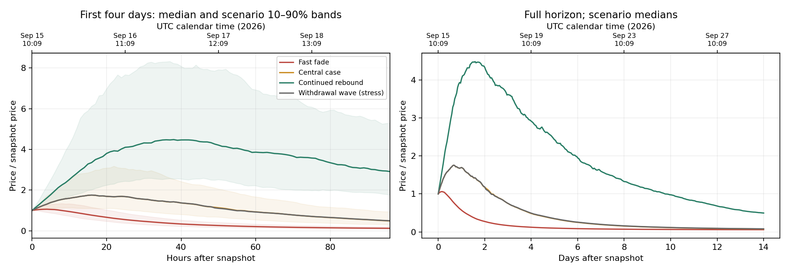
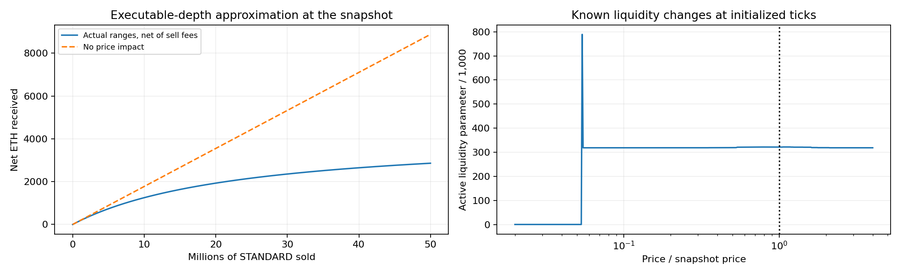

# STANDARD research: flows, liquidity, and selling time

An executed, editable notebook comparing wallet-token sales, Charter withdrawals, branch purchases, reinvestment, and hypothetical funding of another owner's branch.

**[Open the notebook](standard_scenarios.ipynb)** · **[Read the findings](FINDINGS.md)** · [Methodology](METHODOLOGY.md) · [Evidence and reproduction](DATA.md)

## Conditional timing experiment

**Interpretation update:** speculative buying decay is an input, not a predicted event. The notebook does not establish that a flywheel is unlikely or that a drop within 48 hours is likely. See [branch caps and rational demand](RATIONAL_DEMAND.md) for the constraints a demand model must satisfy.

**The central scenario peaks around September 16, 2026 at 14:09 JST, about 19 hours after the frozen snapshot.** Its simulated 10–90% peak-time range is +8 to +32 hours. The central sale-proceeds curve is within 1% of its maximum from **+16 to +22 hours**.

This is a conditional estimate. The short observed history does not establish the future buying half-life. Here is how changing that assumption changes the answer:

| Scenario | Buying half-life | Median simulated price top | Best precommitted wallet sale |
| --- | ---: | ---: | ---: |
| Fast fade | 6 hours | +3 hours | +4 hours |
| Central | 24 hours | +19 hours | +19 hours |
| Continued rebound | 72 hours | +37.5 hours | +35 hours |

The illustrative **30% / 50% / 20% weights are subjective**. Under those weights, the densest six-hour peak bucket is **0–6 hours** (18.8% of weighted paths), while the sale time maximizing mean ETH is **+23 hours**. The early modal bucket reflects the fast-fade paths; the later cash optimum gives weight to the larger payoff in sustained buying paths. Neither is a calibrated market probability.

Snapshot: **2026-09-15 10:09:19 UTC / 19:09:19 JST**, Robinhood chain 4663, block **63,576,310**. Re-running the notebook uses this same frozen observation; it does not turn these dates into a current forecast.



## Known liquidity, including tick ranges

The model uses **3,352.88 ETH of actual pool principal**, reconstructed from **66 initialized ticks and 54 positions**. It does not treat the 4,370.46 ETH active virtual reserve as cash available for selling.

**Locked protocol liquidity is assumed permanently safe and retained**, as requested. It accounts for **3,340.98 ETH** of current principal. The model still allows ETH to leave through swaps. Range crossings, LP fees, hook taxes, and the seller's own price impact are included.



## What is included?

- Executed notebook with editable assumptions and embedded figures.
- Token-flow simulation with ledger issuance, dilution, retirement, congestion fees and fee recycling.
- Wallet quantities of 10,000, 100,000 and 1,000,000 tokens; one- and ten-branch Charters.
- External branch purchases at illustrative opening/floor prices and internal reinvestment.
- Conditional third-party payout-sharing worksheet; native non-owner operations are unavailable in the tested interface.
- Scenario fan charts, peak-time distributions, downside tables, sensitivity heatmap, and Monte Carlo sampling checks.
- Pinned public RPC evidence and read-only collectors.
- Tests covering economic accounting, branch protection, tick crossings, finite liquidity, and observed swap replay.

The optimization selects a **precommitted full-exit hour**, not an adaptive or partial-sale strategy. Branch results at the final simulation boundary are explicitly unresolved. The model targets ETH proceeds, not USD returns.

## Run locally

Python **3.11+**; the published run used Python 3.11.6. All numerical work runs offline after installing packages.

```bash
git clone https://github.com/ryskyboi/standard-research.git
cd standard-research
python -m venv .venv
source .venv/bin/activate
python -m pip install -r requirements.txt
python -m ipykernel install --sys-prefix --name python3 --display-name 'Python 3'
python -m unittest discover -s . -p 'test_*.py' -v
python run_notebook.py
python verify_artifacts.py
```

Open the notebook in VS Code or your preferred Jupyter frontend. Change the configuration and scenario cells, then run all cells. A full run typically takes a few minutes depending on the machine. The saved figures and CSVs are regenerated in `notebook-results/`.

`build_notebook.py` regenerates the notebook from its source template and **overwrites notebook-cell edits**. Use it only if editing that template. Normal users should edit and execute the notebook directly.

No private keys, wallet configuration, trading modules, or transaction submission are included. All chain observations are public; the notebook makes no network calls.
