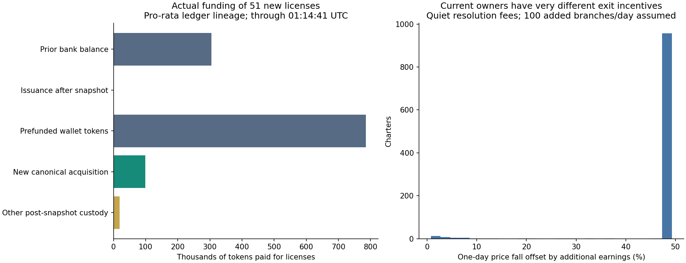

# STANDARD research: incentives, taxes, liquidity and exits

[UTC timestamp reference](TIME_REFERENCE.md): elapsed hours/days are retained; calendar times are UTC.

**Decision-tree coverage:** [what participant choices are modeled, and what remains approximate](DECISION_TREE.md).

An executed, editable notebook for wallet tokens, Charter earnings, branch purchases, reinvestment and hypothetical funding of someone else's branch.

**[Open the agent notebook](rational_scenarios.ipynb)** · **[Read the findings](AGENT_FINDINGS.md)** · [Model and tax details](AGENT_MODEL.md) · [Evidence and reproduction](DATA.md)

**[Action framework: sell, keep branches, or expand?](ACTION_FRAMEWORK.md)** — updated September 16, 01:30:53 UTC.

## Latest tape and inventory findings — September 16, 06:16:07 UTC

**[Why the tape looks all buys or all sells](TRADE_TAPE.md)** · **[Where sellers obtain inventory](SELLER_ORIGINS.md)**

Twenty addresses sold identical fractions of their balances in synchronized batches over seven seconds: 5% repeatedly, then 3%. Nineteen small addresses produced 84 sell transactions totaling only 0.60 ETH; the large address sold 28.23 ETH. This supports automated execution, without establishing ownership or manipulation. The broader uninterrupted streak was 118 sells and 71.25 ETH, with a 3.79% spot decline.

Buying subsequently returned: 107.83 ETH buys versus 8.06 ETH sells from 05:56:10 to 06:16:07 UTC. No contraction-vault buyback had executed. The three largest token destinations received about 64% of that buying; destination concentration does not prove beneficial-owner concentration.

Source tracing through the full 05:40:47 inventory snapshot finds that verified market repurchases supplied 86.8% of incoming tokens to the original seller group. Older holders joining the rolling seller set explain much of its rising remaining inventory. Includes raw RPC evidence, transfer paths, synchronized balance fractions, acquisition histories, executable analysis and charts. The scenario notebooks retain their dated assumptions; this extension does not invent a calibrated probability of another recovery or a selling-stop time.

## Previous update — September 16, 05:56:10 UTC

**[Fresh findings and comparison](behavior-updates/2026-09-16T054047Z/FINDINGS.md)** · **[Executed update notebook](behavior-updates/2026-09-16T054047Z/update.ipynb)**

**Final market check at 05:56:10 UTC:** another 2.30% price decline since the full 05:40:47 snapshot, with 1.30 ETH buying versus 45.58 ETH selling; no buyback execution. Wallet inventories and scenarios retain the full 05:40:47 snapshot.

At that full snapshot, STANDARD had risen 9.15% from the previous snapshot, but was already 8.96% below its intervening peak. The daily license quota filled at 04:01:14 UTC; price peaked at 04:13:44 UTC. The last 20 minutes show 0.36 ETH buying versus 30.43 ETH selling. Recent-seller inventory increased to 4.35m STANDARD, and no buyback has executed. Only 15.7% of the new license spend traces to market purchases after the prior snapshot.

Includes 8,787 individually reconciled token balances, the same eight model cases rerun across 32 paths, an honest check against the earlier saved scenarios, funding rebased to the previous snapshot and exact milestone block headers. The rebound occurred; seller exhaustion and a sustained recovery remain unproven. Earlier dated research is preserved below.

## Participant behavior model — September 16, 02:57:33 UTC

**[Decision map and findings](BEHAVIOR_MAP.md)** · **[Executed, editable notebook](participant_behavior.ipynb)** · **[Model rules and limitations](BEHAVIOR_METHOD.md)**

A new wallet-level model covers selling cadence, partial exits, newly active sellers, speculative re-entry, internal branch funding, fresh purchases, prospective prefunding, retirement and conditional buybacks. It uses 8,575 measured addresses, current Charter ownership and the full canonical liquidity curve. It includes 32 primary paths, eight sensitivity runs, UTC timestamps and conservation checks.

Only 7.8% of the latest 54 licenses' token spend traces to new canonical purchases. All 46 remaining licenses can feasibly use existing balances. New sellers continue to replace old sellers, and buybacks alone do not clear canonical round-trip fees in the illustrated 1 ETH trade. The scenario range is conditional; no most-likely top or calibrated recovery probability is claimed. Action-order and time-step sensitivity make exact simulated selling times unreliable.

Run `python run_notebook.py participant_behavior.ipynb` to execute the saved-data notebook, or follow [full reproduction instructions](BEHAVIOR_MAP.md#reproduce-and-inspect). `python verify_behavior.py` checks the frozen evidence, model, outputs and executed cells. Earlier snapshots below remain dated historical analyses.

## Seller monitor — September 16, 02:48:06 UTC

**[Seller entry cohorts, fixed-group depletion and replacement selling](SELLER_MONITOR.md)**. Three polls show old inventories shrinking while newly active sellers dominate subsequent sales. Includes a public-RPC polling command, per-wallet acquisition lineage, UTC entry observations and a watchlist. No reliable selling-stop time is inferred.

## Fresh buyback-trade check — September 16, 02:22:37 UTC

**[Remaining seller inventory versus buybacks](BUYBACK_TRADE.md)** · **[Liquid supply, vault address and execution status](BUYBACK_STATUS.md)**

Six-hour sellers retain 2.343 million STANDARD; 24-hour sellers retain 7.435 million. The 111.72 ETH current vault buys approximately 1.023 million tokens with no sellers. A modeled 1 ETH canonical-pool entry still loses about 2% after a day of hourly buybacks even with no opposing sellers, because the spot lift does not clear round-trip fees. No scheduled buyback start is verified; owner execution succeeds in simulation but no buyback has occurred.

## Latest: re-entry and buyback map — September 16, 01:47:19 UTC

**[Read the re-entry findings](REENTRY_FINDINGS.md)** · **[Open the executed notebook](reentry_analysis.ipynb)**

Fresh evidence separates the 111.72 ETH buyback vault from 2,344.24 ETH of exactly reconciled, unforwarded hook taxes. Public buyback execution is disabled; the owner counterfactual call succeeds, but no buyback has executed. The current first tick is limited to 6.59 ETH. All 48 remaining daily licenses can feasibly use existing owner inventories and bank ledgers with no compulsory fresh buying.

The notebook quantifies recovery budgets, finite seller inventories, actual license funding, native ETH/WETH/USDG holdings, optional bank withdrawals, dilution, and conditional six-hour paths. The latest 20-minute window has 1.91 ETH buying versus 141.74 ETH selling; scenario outcomes are not assigned invented probabilities.

Run `python run_notebook.py reentry_analysis.ipynb`. Rebuild the saved-data analysis with `python reentry_flow_refresh.py`, `python reentry_followup.py`, `python reentry_model.py`, then `python build_reentry_notebook.py` and execute the notebook. Run `python verify_reentry.py` for frozen artifact integrity; hashes must be regenerated deliberately after changing model or results. Public RPC collectors write a pinned evidence directory and should be run into a new snapshot location when refreshing history.

## Earlier participant and branch-auction evidence

**[Executed participant notebook](participant_analysis.ipynb)** · **[Who bought/sold and how branches were funded](PARTICIPANTS.md)** · [Method and limits](PARTICIPANT_METHOD.md)

The **September 16, 2026 00:44:57 UTC** snapshot traces token inventories, ownership, acquisition sources and split-route trades. A separate **01:14:41 UTC** auction observation records **51 new branches**, real license funding, and a rebound that weakened as selling resumed. The last six-hour canonical buy/sell attribution exceeds 99% by ETH volume. Market-purchased inventory dominated selling; this was not an observed branch-withdrawal wave.

About 90% of tokens spent on the new licenses came from prior bank balances or prefunded wallet inventory. A license sale therefore does not imply an equal new market purchase. The notebook uses actual participant stocks and branch balances for decision sensitivities, and clearly separates conditional earlier stress paths from the later observed auction. It does not assign calibrated top/recovery probabilities.



Run `python run_notebook.py participant_analysis.ipynb` offline. Earlier notebooks below retain their own dated snapshots.

## Earlier recovery update (September 15)

**[Executed recovery notebook](recovery_update.ipynb)** · **[Updated assessment](RECOVERY_FINDINGS.md)**

The September 15, 2026 **22:45:58 UTC** update uses a fresh price, all 77 initialized liquidity ticks, current fees, auction quotas and observed selling. It distinguishes a bounce from regaining earlier prices and calculates the ETH buying required. Scenarios vary seller exhaustion, continuing demand, license funding, buybacks and branch withdrawals. They do not assign calibrated probabilities or claim to know the all-time top.


Run `python run_notebook.py recovery_update.ipynb`. This is a new short-horizon supplement; the agent experiments below retain their original 10:09 UTC snapshot and are not current forecasts.

Earlier observations: [13:40 UTC](live-observations/2026-09-15T13-40-35.886Z/FINDINGS.md) and [22:34 UTC](live-observations/2026-09-15T22-34-29.773Z/FINDINGS.md).

## What can this tell us about the top?

**The available evidence does not establish a most likely all-time top or an inevitable decline within 48 hours.** The new model generates buying from expected profits, available cash and auction eligibility. It does not impose a buying-decay half-life. Its results still depend on assumed capital, expectations and participation limits; they are conditional experiments, not calibrated market probabilities.

The notebook compares eight scenarios, tests capital and license quotas, and checks whether agents' forecasts agree with the paths they generate. A separate [assumption audit](assumption_sensitivity.ipynb) varies spending pace and valuation horizon. It distinguishes the peak in spot price from the best precommitted exit for an existing wallet or branch. An optimum at the final observation remains unresolved.


The [earlier flow notebook](standard_scenarios.ipynb) and [its findings](FINDINGS.md) remain available. Its central peak at +19 hours (2026-09-16 05:09:19 UTC) came from an assumed buying half-life. It is not an independently established forecast and is not the conclusion of the new agent model.

## What is modeled?

- All 999 observed live Charters, with their actual initial integer branch counts and pending balances.
- Ten branches per Charter, three license purchases per Charter per auction day and the global daily quota. Entry, partial retirement and Charter destruction change available capacity.
- Separate ledger reinvestment, spending prefunded tokens, fresh pool purchases and advance inventory purchases.
- Finite banker/speculator cash and explicit optional capital arrivals. Reusing sale proceeds does not count as new capital.
- Trading hook taxes, the pool's LP fee, the 2–60% resolution fee, fee recycling, vault/POL/team routing and hypothetical manual tax overrides.
- ETH Charter auctions closed in the baseline; a separate scenario enables them after 48 hours. Charter payments enter the fee engine, not the token pool directly.
- Optional buybacks and POL under explicit execution assumptions.
- A protected 100,000-token wallet and representative one-branch Charter; hypothetical third-party payout-sharing calculations. The earlier notebook also compares wallet sizes and one-/ten-branch positions.
- Public pinned evidence, offline execution, event ledgers and independent ETH, physical-token and internal-ledger accounting checks.

Agents compare actions under their forecasts. This is an approximate decision model, not a solved strategic equilibrium or a complete dynamic trading strategy. Results target net ETH, not USD.

## Known liquidity

The model reconstructs **3,352.88 ETH of actual pool principal** from **66 initialized ticks and 54 positions**, including range crossings and the seller's own price impact. The 4,370.46 ETH active virtual reserve is not treated as withdrawable cash.

**Locked protocol liquidity is assumed permanently safe and retained.** It accounts for **3,340.98 ETH** of current principal. Swaps can still remove ETH from that liquidity.

Snapshot: **September 15, 2026 at 10:09:19 UTC**, Robinhood chain 4663, block **63,576,310**. Cap getters were checked separately at a later identified block. Re-running uses the same frozen observations; it does not produce a current market forecast.

## Run locally

Python **3.11+**; published execution used Python 3.11.6. Numerical work runs offline after installing packages.

```bash
git clone https://github.com/ryskyboi/standard-research.git
cd standard-research
python -m venv .venv
source .venv/bin/activate
python -m pip install -r requirements.txt
python -m ipykernel install --sys-prefix --name python3 --display-name 'Python 3'
python -m unittest discover -s . -p 'test_*.py' -v
python run_notebook.py
python run_notebook.py assumption_sensitivity.ipynb
python verify_artifacts.py
```

Open `rational_scenarios.ipynb` in Jupyter or VS Code, edit the assumptions and run all cells. The default runs 12 seeds for each of eight 14-day scenarios, plus sensitivity and consistency experiments; allow several minutes. Outputs go to `agent-results/`.

To execute the older imposed-flow comparison:

```bash
python run_notebook.py standard_scenarios.ipynb
```

The `build_*notebook.py` scripts regenerate notebooks from templates and **overwrite notebook-cell edits**. Use them only when editing those templates. Normal users should edit and execute notebooks directly.

No keys, wallet configuration, trading modules or transaction submission are included. All chain observations are public; neither notebook makes network calls.
