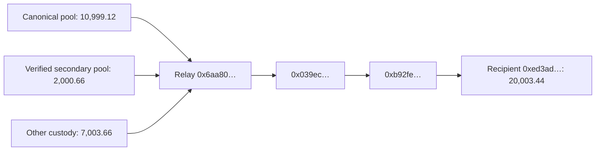

# Where sellers get their STANDARD inventory

**Tracked interval: September 16, 2026, 02:57:33–05:40:47 UTC**, blocks **64,168,224 → 64,265,663**, Robinhood chain **4663**. Token: `0x88ad8DdF1E3898412146a534538d418c6F8A9062`.

This traces the inventories discussed in [the latest full update](behavior-updates/2026-09-16T054047Z/FINDINGS.md). It is not a new current-price snapshot. The later 05:56 market check did not refresh holdings.

## Findings

**The main mechanisms are repurchases by existing traders and older holders starting to sell.** There is also a smaller amount of wallet-to-wallet redistribution. No branch-mint or initial-allocation lineage is identified in this interval's attributed sales or in the current rolling sellers' remaining stock. Unresolved custody routes are not silently labeled purchases, rewards or team sales.

### 1. The original seller group is buying again

The same **547 addresses** began with **2,421,187 STANDARD**, received **963,820**, sent out **1,031,442**, and ended with **2,353,564**. This exact balance bridge includes all transfers; outgoing tokens are not necessarily sales.

| Source | STANDARD | Share of incoming |
| --- | ---: | ---: |
| Canonical-pool repurchases | 783,935 | 81.3% |
| Verified secondary-pool purchases | 52,961 | 5.5% |
| Other wallets’ pre-transaction inventory | 38,052 | 3.9% |
| Other custody output; purchase type unresolved | 87,161 | 9.0% |
| Same-group tokens returning through relays | 1,710 | 0.2% |

Canonical and verified secondary purchases account for **86.8%** of the incoming total. The canonical leg alone is **783,935 tokens bought by 26 addresses**, using **83.93 pool-side ETH** (before adding input hook tax to obtain wallet spending).

The full fixed group also sold **593,577 tokens** for **64.04 pool-side ETH**. On the canonical venue, this fixed group was a **net buyer of 190,358 tokens** over the interval, despite containing addresses that had sold previously. Their aggregate wallet stock can still decline through deposits/burns, other-venue trades and transfers. A fixed “seller” label does not mean every address remains a one-way seller.

There were **429 tokens transferred directly within the fixed group**, excluded from its external receipts. Another **1,710** left and returned across its boundary within the same transaction. That circulation does not add new inventory to the group.

### 2. The rise to 4.35 million is largely a change in who is selling

The current rolling six-hour seller group is a different set:

- **396 addresses** remain in both groups, holding **1,622,589 STANDARD** at the new pin.
- **212 addresses** joined the rolling group, holding **2,728,991 STANDARD**.
- **151 addresses** aged out, still holding **730,975 STANDARD**.

The exact membership bridge is:

`2,353,564 current tokens in the old group − 730,975 aged-out stock + 2,728,991 newly included stock = 4,351,580 current rolling-seller tokens`.

Newly included means new to the rolling seller set, **not a newly created wallet or a first-ever seller**. Several of the largest had acquired tokens around launch and already held substantial balances at the previous snapshot:

| Newly included seller address | Held at 02:57 | Held at 05:40 | First observed canonical buy (UTC, approximate) |
| --- | ---: | ---: | --- |
| `0x8224c04a8f66557df682fd0581eb3724bd2bee07` | 895,118 | 892,110 | 2026-09-15T01:44:03.160981178+00:00 |
| `0x5638484ba2d2f1d1d35020572b0aa439a9869192` | 1,018,742 | 764,635 | 2026-09-15T01:01:43.795429707+00:00 |
| `0x8c509e461bcebe90711e3eb99a6ef1f1ddde3351` | 335,162 | 305,294 | 2026-09-15T02:02:37.294689417+00:00 |
| `0x31caa6199d3fb1e193e968789aea8b7df4ba50af` | 466,623 | 233,311 | 2026-09-15T01:05:29.771509171+00:00 |

These four addresses illustrate activation of existing inventory, rather than newly minted supply arriving. The first two alone account for about **1.66 million** of the new group members' remaining tokens. Their ownership/identity is not inferred from this behavior.

### 3. Concrete transaction trails

#### Buy, then sell approximately 18 minutes later

Address **`0x4ff25ae1b4bf1cee786d5458b43f116d3203d374`** had no tokens at the initial pin:

1. **03:57:01 UTC:** bought **37,986.81 STANDARD** — [buy receipt](https://robinhoodchain.blockscout.com/tx/0x645be7ef327d98c59d52a8733d19c2dfd4f5c7d97fe21212e312edae1d658ced).
2. **03:57:21 UTC:** bought **146,746.73 STANDARD** — [buy receipt](https://robinhoodchain.blockscout.com/tx/0xa3121f313ee4258fe074ed5822354a85c41a3dd1563b4b98a1579b3a8245ff38).
3. **04:15:11 UTC:** sold the resulting **184,733.54 STANDARD** — [sale receipt](https://robinhoodchain.blockscout.com/tx/0x4ddc0b14ddaeb7dcbb175337b3f46cde302ab1c7dc726e90f53bd823c78682b6).

It ended empty. This is directly observed re-entry and exit, not a reward unlock.

#### A “transfer from a wallet” that is actually a routed acquisition

At **03:00:47 UTC**, [this transaction](https://robinhoodchain.blockscout.com/tx/0xf79546cce3882ce33bd77f569955387fd435f2da62c7cd48a8797b57db8833a1) delivered **20,003.44 STANDARD** to `0xed3ad83572cce1e7db2ea644f19abf98fc096684`:

The last sender is a relay in this observed transaction. Counting its payout as unrelated peer funding would miss the pool origins. The **7,003.66** portion stays labeled unresolved custody output; the matching token transfers alone do not establish the exact venue or consideration paid for that leg.

#### Buy in one address, transfer to a different seller

At **03:53:44 UTC**, `0xe4385370a92c6ab64758bc7a9f672e5c1d022ba1` [bought 18,938.18 tokens](https://robinhoodchain.blockscout.com/tx/0x3c0cbbe337d2e9ec184d4550a9d15e992fcc559dbdada89eb913966abb97494e). At **03:53:54 UTC**, it [transferred 18,938.18](https://robinhoodchain.blockscout.com/tx/0x29e9c0be91b7d85ea3c17920a99f8bcad0e072c615369aa407a9c646c0c93bab) to `0x5140087842da3cbc55ff69ba74b4239af219c4b6`.

The recipient later [sold 9,722.99 tokens at 05:02:07 UTC](https://robinhoodchain.blockscout.com/tx/0x38504b07e419bec86445f61c0153a952762ad450dd56edeb59f4ecdb6e8fb7d2), followed by further sales. It also held other inventory, so particular fungible units cannot be identified without an allocation convention. This supports market-origin inventory passing to a seller; it does **not** prove the two addresses have the same owner.

All seven linked receipts were checked for success and matching block hashes. Their UTC times come from exact block headers, unlike the interpolated time labels in broader CSV tables. [Archived checks and receipts](seller-origin-evidence/checks.json).

### 4. Origins of what was sold and what remains

Of **2.481 million attributed tokens sold** between the pins, **85.0%** traces to canonical or verified secondary market purchases, including tokens passed between wallets. The other **15.0%** is other custody/unresolved lineage.

Of the current rolling sellers' **4.352 million remaining tokens**, **87.1%** traces to those market-purchase origins and **12.9%** remains other/unresolved. Neither table identifies branch withdrawals or initial allocations as a source. These full-history mixes use the frozen pro-rata provenance method; they are distinct from the immediate incoming-transfer classification above.

## What this changes in the flow model

Do not model recent sellers as a fixed pile draining steadily to zero. Some rebuy, some move balances between addresses, some deposit or leave the rolling window, and older holders become active sellers. In this interval the old group bought more tokens than it sold on the canonical pool while newer group members supplied most sales. The depletion clock must account for both replenishment and changing membership.

Source tracing alone does not establish coordination or team control. A separate [trade-tape investigation](TRADE_TAPE.md) documents synchronized fractional selling, while leaving ownership unresolved. It tracks token sources, not private identities or the origin of the ETH used to purchase them. No sales or purchases were executed by this research.

## Files, method and limitations

- [Each incoming transfer](seller-origin-results/incoming-transfers.csv).
- [Economic roots after tracing relays](seller-origin-results/incoming-economic-sources.csv.gz).
- [Replenished addresses and their purchases/sales](seller-origin-results/replenished-wallets.csv).
- [Complete interval transfer graph](seller-origin-results/interval-transfer-graph.csv.gz).
- [New seller-group members and prior holdings](seller-origin-results/new-seller-group-members.csv).
- [Origins of sold tokens](seller-origin-results/sold-token-origins.csv) and [remaining inventory](seller-origin-results/remaining-token-origins.csv).
- [Peer-source acquisition history](seller-origin-results/peer-source-acquisition-history.csv.gz) and [example transaction paths](seller-origin-results/example-transaction-paths.csv).
- [Source code](trace_seller_origins.py), [raw verification responses](seller-origin-evidence/raw.json.gz) and [summary](seller-origin-results/summary.json).

Token transfers are replayed in block/transaction/log order from the previous pinned balances. Every collected ending balance and total supply reconciles exactly in integer units. Within-transaction mixtures use pro-rata source attribution; source-tag error is below **7.5e-09 STANDARD**. Pool origins are backed by decoded swap legs; canonical transactions with liquidity changes remain conservative/unresolved. This is source tracing, not proof that a particular fungible token was later sold.

The largest unresolved custody origin is `0x65ee0e9d98ed1564655ac51d78ffd6ef61f66404`, contributing about **78,435 tokens**. Additional historical contract-state checks failed because the public RPC no longer served that old state. The failure is archived; no current-state lookup was substituted as proof of the historical role. Existing saved logs, balances and the seven example receipts remain available and reconciled.

Run `python trace_seller_origins.py`, `python build_seller_origins.py` and `python -m unittest discover -p test_seller_origins.py -v` offline. `python verify_seller_origins.py` verifies the frozen release; rebuilding compressed outputs requires a deliberate manifest refresh after review. The earlier scenario notebooks and snapshots are unchanged.
