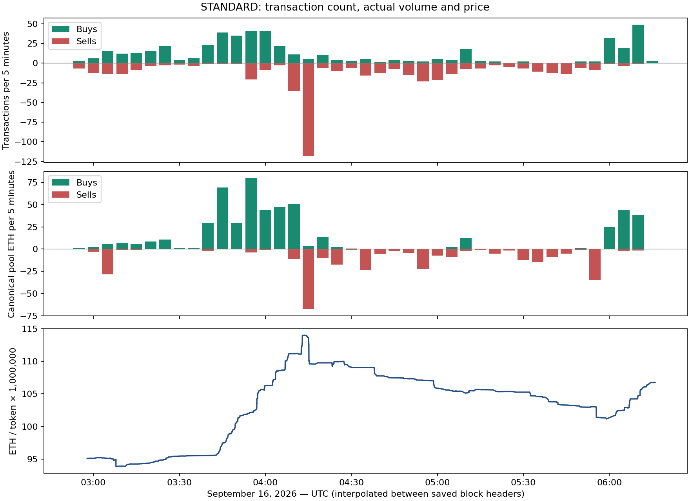

# Why the STANDARD tape looks all buys or all sells

**Observed through September 16, 2026, 06:16:07 UTC.** Robinhood chain 4663; STANDARD `0x88ad8DdF1E3898412146a534538d418c6F8A9062`; canonical pool `0xc73f3cd3fb68288e63f008e08ef69caa0437224e420963c6aeb4526178e87ad9`.

**Conclusion:** there is direct evidence of synchronized, repeated execution across a group of addresses. Numerous tiny transactions magnify the visual impression of selling, while a few much larger flows drive price. This supports an automation explanation; it does not establish who owns the addresses, team involvement, deceptive intent or wash trading.

## The strongest example: synchronized fractional selling

Between **04:15:06 and 04:15:13 UTC**, 20 addresses sold in repeated batches. Every observed sale in the first five batches was exactly **5% of that address's pre-transaction token balance**; the last batch sold **3%**. These are exact block-header times and fractions reconstructed from integer token balances and Transfer logs.

| Block | UTC | Addresses in selected group | Fraction of remaining tokens sold | Pool ETH sold |
|---|---|---:|---:|---:|
| 64214492 | 04:15:06 | 20 | 5% | 5.8869 |
| 64214500 | 04:15:06 | 20 | 5% | 5.5739 |
| 64214516 | 04:15:08 | 5 | 5% | 5.1590 |
| 64214531 | 04:15:10 | 20 | 5% | 5.0058 |
| 64214543 | 04:15:11 | 5 | 5% | 4.5537 |
| 64214560 | 04:15:13 | 20 | 3% | 2.6575 |

- The large address, [`0x5638484ba2d2f1d1d35020572b0aa439a9869192`](https://robinhoodchain.blockscout.com/address/0x5638484ba2d2f1d1d35020572b0aa439a9869192), sold **254,107 STANDARD for 28.23 pool ETH in six trades**. Its balance before these trades was 1,018,742 tokens. At the earlier full inventory snapshot, 05:40:47 UTC, it still held **764,635 STANDARD**. This is not a fresh 06:16 balance query.
- The other **19 addresses generated 84 sell transactions for just 0.6023 ETH combined**. They account for 93.3% of this group's transaction count but only 2.1% of its volume.
- **19 of these addresses first acquired tokens in the same earlier block, 63,252,524**, through attributed canonical purchases. Their acquisition histories contain repeated matching purchase blocks. Their later sales therefore have a shared execution pattern extending beyond this one minute.
- Transaction envelopes for the first batch show 20 different sending addresses using the same destination and function selector. This is a set of separate transactions, not one swap duplicated by counting routing hops. Shared execution infrastructure alone is not proof of common ownership.

**Interpretation:** synchronized software, a common execution system, or closely linked trading instructions fit this pattern much better than twenty unrelated manual decisions. The evidence does not distinguish those possibilities. Some small-wallet trades precede the large wallet within the same block, so a simple claim that all of them merely copied its already-confirmed trade would be too strong.

The wider uninterrupted run contained **118 sells from 35 attributed source addresses**, from **04:14:25 to 04:15:22 UTC**, totaling **71.25 pool ETH**. Spot fell **3.79%** over that run. Two addresses alone—the fractional seller above and the rebuyer documented in [seller origins](SELLER_ORIGINS.md)—accounted for about 68% of that ETH selling. Small repeated sells inflated the count; material sales still moved the price.

## Buying comes in waves too

From **05:56:10 to 06:16:07 UTC**, there were **104 buys totaling 107.83 ETH**, versus **11 sells totaling 8.06 ETH**. The three largest token recipient addresses accounted for **63.9% of canonical buying volume**.

Be careful with the word “buyers”: the largest recipient, `0x2408ce75d217e3a70d6ca370c78c1b34d706f5a0`, received tokens associated with **37.69 ETH** of canonical purchases across four transactions submitted by **four different transaction senders**. It is a concentration of token destinations, not proof of one person providing all the capital. No outgoing STANDARD transfers from that recipient were observed in the new 05:40–06:16 interval. Relayers and beneficial ownership remain unresolved.

The saved buyback getter still reports **`lastTickAt = 0`**. These purchases cannot be attributed to an observed contraction-vault buyback. Today's license quota had already filled at **04:01:14 UTC**; this later buying also cannot simply be equated with purchasing currently available daily licenses. Speculation or buying ahead of future game activity is possible; the transfers do not reveal intent.

## Why this produces one-sided price action

1. **Repeated execution amplifies the tape.** One coordinated execution episode can create dozens of red or green rows. Treating each row as an independent person's decision substantially overstates participation.
2. **Volume matters more than the number of trades.** A 0.005 ETH sell and a 5 ETH sell each produce one red row; the latter is about 1,000 times larger. Within a shared active liquidity range, the large flow has much more price impact.
3. **The AMM supplies the counterparty.** A series of sellers trades against pool reserves; human buyers do not need to alternate with them. When outside demand arrives or existing inventory is offered in a burst, directional runs can persist.
4. **Fees can discourage small countertrend trades.** The prior verified schedule—2% buy hook tax, 3% sell hook tax and 1% LP fee per side—requires roughly a 7.33% gross price rise to clear a canonical round trip before gas/slippage. That is an economic reason why small dips need not attract immediate arbitrage-like buying, not proof of any particular wallet's motivation. See [fee model](BEHAVIOR_METHOD.md).

This explains why the chart can switch abruptly between red and green. It does **not** prove that every wave has the same organizer, nor that a recovery will persist. The correct modeling implication is to include correlated execution bursts and volume concentration, rather than independently sampling every transaction as a separate actor. The previously published scenario engine has not been recalibrated to infer a bot-cluster arrival rate from this single selected episode.

## Scope, checks and reproduction

- Main interval: blocks **64,168,224 exclusive to 64,286,684 inclusive** (02:57:33–06:16:07 UTC). Final block hash: `0xc26416bd52e42a02fa533c5ddb9b9ffa359a5854bcf15ddb5d431dcd977cbb62`.
- 967 unique canonical swap transactions and 967 canonical Swap logs; **0 multiple-canonical-swap transactions** and 0 mixed-direction transactions in this interval. Other venue legs are excluded from ETH totals. Pool ETH is not wallet proceeds after every tax and routing cost.
- Token source/destination attribution covers **97.10%** of gross canonical ETH volume. Ambiguous transactions stay unattributed. Contract addresses and token recipients are not assumed to be independent investors.
- Runs are calculated without a size filter and with explicitly labeled 0.1 ETH and 1 ETH thresholds. Filtering can join otherwise separate runs; [all run results](tape-results/runs.csv) retain the threshold. The 118-sell finding uses **no size filter**.
- Exact times are used where headers were collected; other event times and five-minute bins are interpolated between saved headers. Event block/transaction order is exact. The highlighted 20-address group is selected after observing the dense block; this is descriptive evidence, not a pre-registered statistical test of manipulation.
- Fresh collection is a limited tape/vault check, not a complete refresh of balances, liquidity custody, branch inventories or scenario probabilities. No automatic sell-stop time or most-likely top is inferred.

Offline reproduction: `python analyze_trade_tape.py`, then `MPLCONFIGDIR=/tmp/standard-research-mpl python build_trade_tape.py`. Run `python -m unittest test_trade_tape test_seller_origins` and `python verify_seller_origins.py` to check conservation, attribution, recorded transactions and frozen files. Collectors are read-only and use the public RPC; preserve this packet before collecting a new one.

Evidence: [fresh raw RPC and decoded logs](tape-evidence/tape.json), [exact headers and transaction envelopes](tape-evidence/details.json), [prior frozen evidence](behavior-updates/2026-09-16T054047Z/manifest.json), [individual transactions](tape-results/transactions.csv.gz), [synchronized sells and balance fractions](tape-results/synchronized-sells.csv), [acquisition histories](tape-results/synchronized-wallet-acquisitions.csv.gz), [five-minute flows](tape-results/five-minute-flows.csv).
