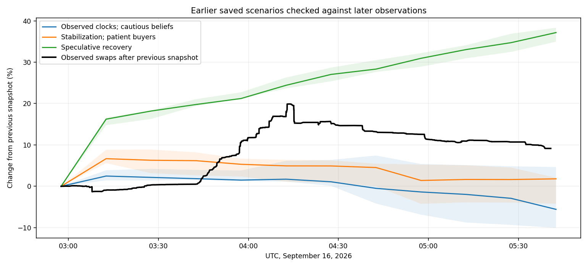
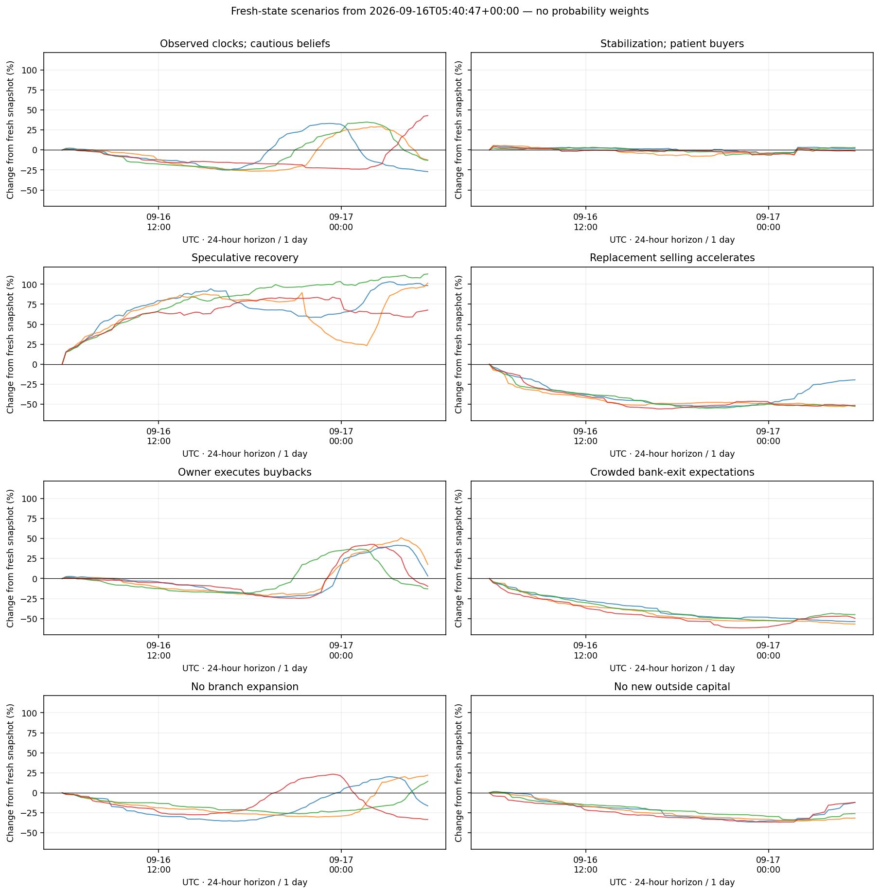

# Fresh STANDARD findings — September 16, 05:40:47 UTC

**Block 64,265,663, chain 4663.** Token `0x88ad8DdF1E3898412146a534538d418c6F8A9062`. This update compares the frozen **02:57:33 UTC** snapshot with **05:40:47 UTC**, a gap of **2.721 hours / 0.1134 days**.

**[Open the executed notebook](update.ipynb)** · [Previous research](../../BEHAVIOR_MAP.md) · [Unchanged decision-model rules](../../BEHAVIOR_METHOD.md) · [Machine-readable summary](results/update-summary.json).


## Final market check — 2026-09-16 05:56:10+00:00

A later, limited check shows **-2.30%** since the full 05:40:47 snapshot, with **1.30 ETH buying versus 45.58 ETH selling** during that interval. Spot is **0.000101403 ETH per STANDARD**, and `lastTickAt` remains **0**. This reinforces the observation of renewed selling after the rebound. [Raw final check](tail-check.json). Wallet inventories, branch funding and model scenarios below still use **05:40:47 UTC**; they were not silently relabeled as newer.

## What changed

**The token recovered 9.15% without any executed buybacks.** Canonical buying was **429.88 ETH** versus **262.61 ETH** selling over the interval: **+167.27 ETH net pool flow**. These are pool-side amounts: buy ETH after input hook tax, sell ETH before output hook tax; LP fees also affect principal. Exact new swaps are selected by block number.

**It has already given back part of that rebound:** the interval high was **+19.90%** at **2026-09-16T04:13:44+00:00**, and the fresh price is **-8.96% below that high**. Across all canonical swaps, the last 20 minutes show **0.36 ETH buying versus 30.43 ETH selling**. This makes the immediate picture weaker than the positive full-interval net flow suggests.

| Metric | 02:57:33 UTC | 05:40:47 UTC |
| --- | --- | --- |
| Spot ETH / STANDARD | 0.000095091 | 0.000103789 (+9.15%) |
| Pool ETH principal | 2,223.33 | 2,393.59 |
| Branches | 1153 | 1199 |
| Daily licenses remaining | 46 | 0 |
| Bank claims (STANDARD) | 1,413,082 | 1,437,620 |
| Rolling six-hour seller inventory | 2,421,187 | 4,351,580 |
| Same old seller group inventory | 2,421,187 | 2,353,564 |
| Buyback vault ETH | 111.72 | 111.72 |
| Executed buyback tick timestamp | 0 | 0 |

**The latest window is weaker than the interval average:** its attributed buying is only **0.36 ETH**, against **29.57 ETH** selling. The rolling seller inventory has increased even though the fixed old group's balance fell slightly. This is evidence of a rebound with renewed selling pressure, not evidence that sellers are exhausted.

The previous cautious case did **not** capture the magnitude of this rebound. At the new observation time, its four old paths showed **-9.97% to +4.68%**, median **-5.26%**, versus the actual **+9.15%**. The bullish case overshot the observed move. This is a genuine comparison against previously saved paths, not a claim of predictive success or a reason to assign new probabilities from one observation.



## Branch buying: the auction is now sold out

All **46** licenses that remained at 02:57:33 UTC sold, taking the total to **1199 branches**. They consumed **683,409 STANDARD**. Under the same pro-rata lineage convention, **107,055 tokens (15.7%)** came from canonical purchases **after the previous snapshot**. The remaining sources are tabulated in [the interval funding ledger](results/interval-funding/followup-license-funding.csv). This is rebased to 02:57:33 UTC, not merely a subtraction from the older 00:44 dataset.

There are **zero licenses left today**. New license purchases resume at **2026-09-17T01:04:04+00:00** (September 17, 01:04:04 UTC), unless protocol parameters change. ETH Charter auctions remain disabled. Buying to prefund tomorrow or to speculate can continue; sold out does not logically force all buying to stop.

The final license sale was at **2026-09-16T04:01:14+00:00**, about 12½ minutes before the observed price high. Both milestone times are verified from [their exact block headers](evidence/milestone-headers.json). This sequence is consistent with auction-related attention fading, but does not establish that quota exhaustion caused the reversal; most buying was not traced into spent licenses.

[Interval buyers](results/interval-buyers.csv) and [sellers](results/interval-sellers.csv) include their current inventories and Charter ownership. The largest attributed buyer, `0xfc3c962fad2c1cc77f1a0d46e7b8a2de79a21774`, bought **58.60 pool ETH** (14.4% of attributed buying). Ownership alone does not prove that those purchases funded licenses; the separate deposit and license ledger supplies the stronger evidence of use.

At unchanged parameters and the current branch count, the next day's opening license ask is about **29,528 STANDARD**. A constructive allocation of the next 100 licenses, crediting issuance until reset and sharing each owner's wallet only once, needs **0 freshly acquired tokens**. This is feasibility, not expected winners or guaranteed demand. Buying all 100 entirely fresh at that opening ask would cost about **344.6 ETH** on today's curve; the ask decays later and the curve can change.

Current gross accrual per branch is **583.82 STANDARD/day**. Extra branches dilute this rate. There were **0 new branch withdrawals** in this interval, so this observed flow was not a new branch-retirement wave. Claims accrue internally and only become tradeable through retirement/minting.

## Are sellers exhausting?

The same old seller group went from **2.421m** to **2.354m STANDARD**. Its exact transfer bridge includes **963,820 incoming** and **1,031,442 outgoing tokens**; transfers are not all sales. Meanwhile, the current rolling six-hour seller group retains **4.352m**. Those groups are different and must not be treated as one depleting stock.

Across the update interval, **76.1%** of attributed sold tokens came from addresses outside the previous six-hour seller set; **41.8%** came from addresses making their first observed canonical sale after the previous pin. [Address inventories and acquisition sources](results/seller-inventory-and-entry.csv) are saved so this can be inspected directly.

The latest 20-minute attributed window had **0.36 ETH buying** and **29.57 ETH selling**, net **-29.21 ETH**. First-observed sellers supplied **50.2%** of tokens sold in that window. Short-window membership uses interpolated timestamps; the full-interval block-based totals above do not.

## Buybacks and re-entry economics

The vault still holds **111.72 ETH**, with `lastTickAt = 0`. The buyback address remains `0x796e80E8ABcedc30c700A9587F7933d3342B8946`. Fresh [execution calls](evidence/buyback-execution.json) and [event history](evidence/vault-events.json) are included. No buyback start date is established by this evidence.

At this new price, the first-tick limit is **6.49 ETH**. With no opposing sellers and successful hourly execution, the 24-hour buyback-only test spends **100.69 ETH**, moves spot **+5.18%**, and leaves a new 1 ETH canonical entry at **-2.05%** after selling. It excludes gas and assumes TWAP gates pass. The hook's **2,375.87 ETH** is separate from the executable vault; it is not immediately counted as buyback spending.

For perspective, a hypothetical 1 ETH purchase at the **old** snapshot and sale at the **new** snapshot quotes about **+1.64%** after canonical fees and impact. This is a small-order hindsight counterfactual, not a trade we made and not a prediction that buying now repeats that return. Today's re-entry faces today's price and seller inventories.

## Updated conditional paths

The same eight parameter sets were rerun with **fresh wallet balances, activity rates, branch state and liquidity**. Each has four seeds and a 24-hour horizon ending **2026-09-17 05:40:47+00:00**. These restart the original model, including its zero initial momentum and fresh mean-reversion anchor; they are not a Bayesian posterior or a seamless continuation of an earlier trajectory.

| Same assumption set | 24h median | Four-run range | Fresh license ETH | Prospective prefunding ETH |
| --- | --- | --- | --- | --- |
| Observed clocks; cautious beliefs | -12.8% | -27.1% to +42.9% | 7.8 | 302.2 |
| Stabilization; patient buyers | +0.3% | -1.2% to +3.0% | 41.6 | 224.3 |
| Speculative recovery | +99.9% | +67.7% to +112.8% | 24.4 | 290.8 |
| Replacement selling accelerates | -51.8% | -52.6% to -19.5% | 8.5 | 43.3 |
| Owner executes buybacks | -3.3% | -12.9% to +17.5% | 9.9 | 312.1 |
| Crowded bank-exit expectations | -51.7% | -56.9% to -45.1% | 4.0 | 0.0 |
| No branch expansion | -1.0% | -33.3% to +22.1% | 0.0 | 0.0 |
| No new outside capital | -19.0% | -31.6% to -12.0% | 70.4 | 245.5 |

Newcomer capital is still an assumption extrapolated from observed first-buyer spending, now about **45.09 ETH/hour** before the scenario multiplier. Public cash balances remain capacity rather than committed demand. The earlier time-step, action-order and valuation sensitivities still apply. No probability weights or precise selling deadline are justified by these reruns.



## Interpretation

The rebound is observed, and the market has absorbed selling better over this interval than the old cautious paths assumed. It was not caused by an executed buyback. Whether the improvement persists depends on new purchases after today's license quota is exhausted, continued prefunding/speculation, and the activation or replenishment of sellers. A smaller old-seller balance alone cannot establish that selling is finished.

The latest window's return to net selling and the larger rolling seller inventory argue against treating the rebound as a confirmed sustained recovery. Conversely, the actual +9.15% move disproves any claim that decline from the previous snapshot was inevitable. The refreshed evidence supports this conditional assessment rather than a precise recovery probability or a deadline for selling to stop.

The [fresh recovery-budget table](results/recovery-flow-requirements.csv) asks how much buying is needed for +10%, +25%, +50% or +100% spot under different fractions of recent-seller inventory being sold. This is a more directly testable condition than asserting that the token has permanently topped or that a further recovery is inevitable.

## Reproduction and evidence

All **8,787 measured token balances** reconcile individually, and the replay reconciles total supply. Both snapshots, the fixed seller inventory bridge, the branch-funding ledger and simulated asset conservation are checked. Historical route attribution remains incomplete and motives are inferred only as labeled; token lineage is pro-rata, not proof of particular fungible units. Locked liquidity is retained in the future model, with its actual fresh ranges and principal.

From the repository root:

```bash
OPENBLAS_NUM_THREADS=1 python refresh_behavior_update.py behavior-updates/2026-09-16T054047Z
python analyze_behavior_update.py behavior-updates/2026-09-16T054047Z
python build_behavior_update.py behavior-updates/2026-09-16T054047Z
python run_notebook.py behavior-updates/2026-09-16T054047Z/update.ipynb
python verify_behavior_update.py behavior-updates/2026-09-16T054047Z
```

The manifest freezes the published bytes. Rebuilding changes output hashes; verify the published copy first and regenerate the manifest deliberately after a reviewed rebuild. The original collection scripts were run in an isolated layout with the old shared inputs and a new output directory, so previous evidence was preserved. Public RPC requests and responses are archived; no credentialed endpoint, key or signed transaction is needed.
